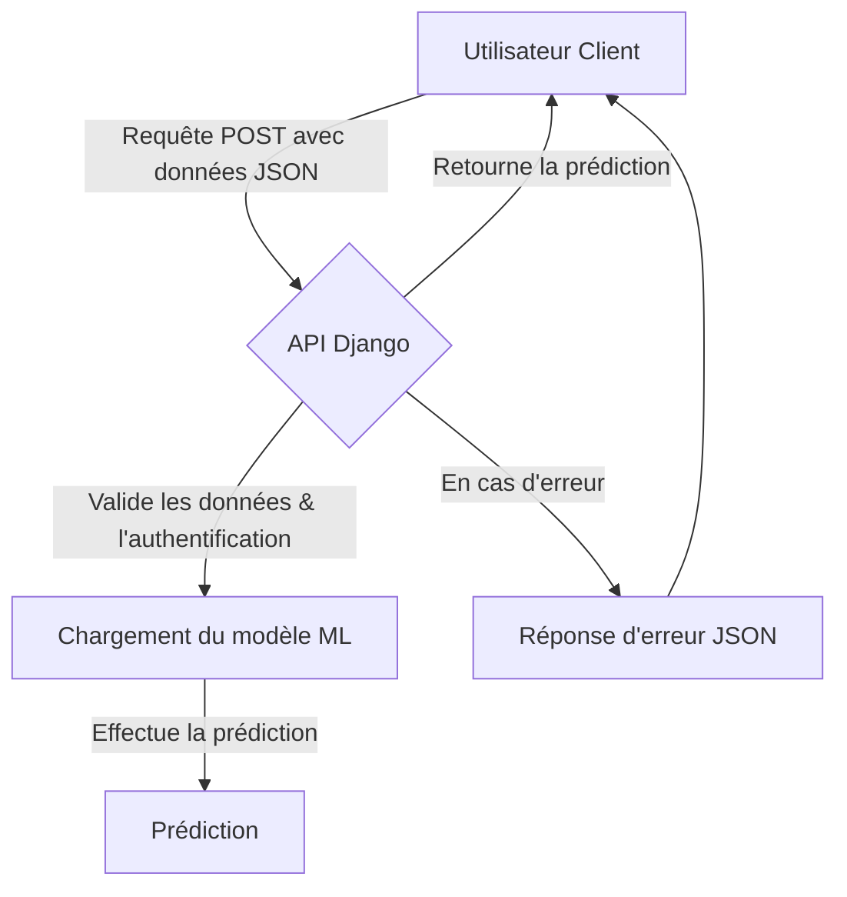

# Livrable E3 : Déploiement et Monitoring d'un Modèle d'IA

**Étudiant :** [Your Name]
**Projet :** AutoML-Gr4-1 - CSV Analyzer
**Date :** [Date]

---

## SOMMAIRE

1.  [Introduction](#introduction)
2.  [Expression du besoin](#expression-du-besoin)
3.  [Développement de l’API](#développement-de-lapi)
    - [Spécifications fonctionnelles et techniques](#spécifications-fonctionnelles-et-techniques)
    - [Conception de l’architecture de l’API](#conception-de-larchitecture-de-lapi)
    - [Environnement de développement](#environnement-de-développement)
    - [Tests de l’API](#tests-de-lapi)
4.  [Intégration de l’API](#intégration-de-lapi)
    - [Étapes d’authentification](#etapes-dauthentification)
    - [Communication avec les points de terminaison](#communication-avec-les-points-de-terminaison)
    - [Adaptation de l’interface](#adaptation-de-linterface)
    - [Tests d’intégration](#tests-dintégration)
5.  [Monitoring du modèle d’IA](#monitoring-du-modèle-dia)
    - [Métriques de monitoring](#métriques-de-monitoring)
    - [Outil(s) de monitoring](#outils-de-monitoring)
    - [Restitution du monitoring](#restitution-du-monitoring)
    - [Test de la chaine de monitoring](#test-de-la-chaine-de-monitoring)
6.  [Tests automatisés du modèle d’IA](#tests-automatisés-du-modèle-dia)
    - [Situations de test](#situations-de-test)
    - [Outils de test](#outils-de-test)
    - [Interprétation des tests](#interprétation-des-tests)
7.  [Livraison continue du modèle d’IA](#livraison-continue-du-modèle-dia)
    - [Définition de la chaine de livraison](#définition-de-la-chaine-de-livraison)
    - [Déclencheurs](#déclencheurs)
    - [Configuration de la chaine de livraison](#configuration-de-la-chaine-de-livraison)
8.  [Documentation](#documentation)
9.  [Perspectives et améliorations](#perspectives-et-améliorations)
10. [Conclusions](#conclusions)
11. [Annexes](#annexes)

---

## 1. Introduction

Ce rapport s'inscrit dans la continuité du livrable E2, qui portait sur la veille technologique et la conception initiale d'un modèle d'intelligence artificielle. Le présent document, livrable E3, se concentre sur la mise en œuvre pratique, le déploiement, et la maintenance opérationnelle de la solution d'IA développée. L'objectif est de démontrer la maîtrise de l'ensemble du cycle de vie d'un projet MLOps, de l'exposition du modèle via une API REST à son intégration, son monitoring en temps réel et l'automatisation de sa livraison.

Nous détaillerons l'architecture technique de l'API, les stratégies de test mises en place pour garantir sa fiabilité, les mécanismes de monitoring pour superviser la performance du modèle en production, et enfin, la chaîne d'intégration et de déploiement continus (CI/CD) qui assure la qualité et l'agilité du projet.

## 2. Expression du besoin

Le besoin au cœur de ce projet est de fournir une plateforme web simple et intuitive permettant à des utilisateurs, tels que des data scientists ou des analystes métier, d'automatiser une partie du processus de modélisation prédictive. L'application doit permettre de :

1.  **Téléverser un jeu de données** au format CSV.
2.  **Visualiser et nettoyer** ces données (gestion des valeurs manquantes, suppression de lignes, etc.).
3.  **Entraîner un modèle** de Machine Learning (classification ou régression) sur les données préparées, en choisissant la variable cible.
4.  **Évaluer la performance** du modèle grâce à des métriques pertinentes.
5.  **Exposer le modèle entraîné** via une API sécurisée pour permettre des prédictions sur de nouvelles données.

Ce besoin répond à une demande croissante d'outils "low-code" en science des données, visant à accélérer la phase d'expérimentation et à rendre les modèles d'IA plus accessibles pour des prédictions unitaires ou des intégrations dans d'autres systèmes.

## 3. Développement de l’API

Pour permettre l'interaction avec le modèle d'IA entraîné, une API REST a été développée en utilisant le framework Django. Elle sert de pont entre le modèle et les applications clientes.

### Spécifications fonctionnelles et techniques

**Spécifications fonctionnelles :**

*   L'API doit exposer un point de terminaison (`endpoint`) pour la prédiction.
*   Cet endpoint doit accepter en entrée les valeurs des caractéristiques (features) du modèle.
*   Il doit retourner en sortie la prédiction du modèle (par exemple, une classe ou une valeur numérique).
*   L'accès à l'API doit être restreint aux utilisateurs authentifiés.
*   L'API doit gérer les erreurs de manière appropriée (données d'entrée invalides, features manquantes, etc.).

**Spécifications techniques :**

*   **Framework :** Django
*   **Format des données :** JSON pour les requêtes et les réponses.
*   **Authentification :** Basée sur les sessions Django.
*   **Endpoint principal :** `/test_model/<int:csv_file_id>/`

**Schéma fonctionnel :**

### Conception de l’architecture de l’API

L'architecture de l'API est conçue autour des principes REST. Le projet utilise Django pour créer et gérer les points de terminaison.

*   **Points de terminaison (Endpoints) :**
    *   `POST /test_model/<int:csv_file_id>/`: C'est le point de terminaison principal pour l'inférence. Il est dynamique et dépend de l'ID du fichier CSV sur lequel le modèle a été entraîné. Il attend une requête POST contenant les données d'entrée pour la prédiction au format JSON.
    *   D'autres URL comme `/upload/`, `/view/<int:csv_file_id>/`, `/train_model/<int:csv_file_id>/` gèrent le flux de l'application web mais ne sont pas des endpoints d'API REST au sens strict pour l'inférence.

*   **Règles d’accès et Sécurité :**
    *   **Authentification :** L'accès à la fonctionnalité de test du modèle (et donc à l'API de prédiction) est protégé par le décorateur `@login_required` de Django. Seuls les utilisateurs connectés peuvent y accéder. Cela prévient l'accès non autorisé, conformément à la recommandation **OWASP A1:2021 – Broken Access Control**.
    *   **Protection CSRF :** Django intègre nativement une protection contre les attaques de type Cross-Site Request Forgery (CSRF), qui est active sur les formulaires et les requêtes POST, sécurisant ainsi l'API contre ce type de vulnérabilité.
    *   **Gestion des erreurs :** Le code dans `views.py` gère explicitement les cas où les données d'entrée sont manquantes ou invalides, renvoyant des messages d'erreur clairs à l'utilisateur au lieu d'une erreur serveur générique (500), ce qui est une bonne pratique de sécurité.

### Environnement de développement

L'environnement de développement est conteneurisé à l'aide de Docker pour garantir la reproductibilité et la cohérence entre les différents environnements (développement, test, production).

*   **Langage :** Python 3.9
*   **Framework Web :** Django
*   **Base de données :** SQLite (pour le développement)
*   **Conteneurisation :** Docker, Docker Compose
*   **Bibliothèques principales :**
    *   `pandas` pour la manipulation des données.
    *   `scikit-learn` pour l'entraînement des modèles de Machine Learning.
    *   `mlflow` pour le suivi des expérimentations et le versioning des modèles.
*   **Serveur d'application :** Gunicorn (implicite pour un déploiement Django standard).

### Tests de l’API

Les tests de l'API sont cruciaux pour garantir son bon fonctionnement et sa robustesse. Ils sont implémentés dans le fichier `csv_processor/tests/test_views.py` en utilisant le framework de test de Django et `pytest`.

*   **Couverture des tests :**
    *   **Test de l'accès GET :** Un test vérifie que la page de test du modèle se charge correctement pour un utilisateur authentifié.
    *   **Test de prédiction (cas nominal) :** Un test envoie une requête POST avec des données valides au point de terminaison `/test_model/.../` et vérifie que la réponse contient bien une prédiction, sans erreur.
    *   **Test avec données manquantes :** Un test simule une requête où une ou plusieurs features sont manquantes. Il vérifie que l'API renvoie un message d'erreur approprié (par exemple, "Please enter a value for feature...").
    *   **Test avec données invalides :** Un test envoie des données qui ne peuvent pas être converties dans le type attendu (par exemple, du texte pour une feature numérique). Il vérifie que l'API renvoie une erreur de valeur invalide.

*   **Exécution et interprétation :**
    *   Les tests sont exécutés via la commande `pytest`.
    *   Les assertions dans les tests (`assert`) comparent le comportement obtenu (le contenu de la réponse, les messages d'erreur) avec le comportement attendu. Si toutes les assertions passent, le test est réussi, confirmant que l'API se comporte comme prévu pour ce cas de figure.

## 4. Intégration de l’API

L'API n'est pas seulement une entité isolée ; elle est intégrée directement dans l'application web Django pour fournir la fonctionnalité de test de modèle en temps réel à l'utilisateur.

### Etapes d’authentification

Comme mentionné précédemment, l'intégration repose sur le système d'authentification de Django. La vue `test_model` est protégée par le décorateur `@login_required`. 
1.  L'utilisateur doit d'abord se connecter à l'application via le formulaire de login.
2.  Une fois connecté, Django crée une session utilisateur.
3.  Lors de l'accès à la page de test, le décorateur vérifie la présence de cette session active. Si l'utilisateur n'est pas connecté, il est redirigé vers la page de connexion.

### Communication avec les points de terminaison

La communication avec l'endpoint `/test_model/.../` se fait via un formulaire HTML classique soumis par l'utilisateur depuis son navigateur. 
1.  L'utilisateur remplit les champs du formulaire, qui correspondent aux features du modèle.
2.  En cliquant sur "Prédire", le navigateur envoie une requête `POST` à l'URL courante.
3.  La vue Django `test_model` intercepte cette requête, extrait les données du formulaire (`request.POST`), et les traite pour effectuer la prédiction.
4.  La vue rend ensuite à nouveau le template `test_model.html`, en y ajoutant le résultat de la prédiction ou les messages d'erreur.

### Adaptation de l’interface

L'interface utilisateur, définie dans le template `templates/csv_processor/test_model.html`, est générée dynamiquement. Elle s'adapte au modèle qui a été entraîné :
*   Le formulaire affiche un champ d'entrée pour chaque feature utilisée par le modèle.
*   Après une prédiction réussie, le résultat est affiché clairement sur la même page.
*   En cas d'erreur (champ manquant, valeur invalide), des messages d'erreur de Django (`messages.error`) sont affichés en haut de la page pour guider l'utilisateur.

### Tests d’intégration

Les tests décrits dans la section `Tests de l’API` fonctionnent également comme des tests d'intégration de base. En effet, ils ne testent pas seulement la logique de la vue de manière isolée, mais ils simulent une requête HTTP complète (via le client de test de Django) et vérifient la réponse HTML rendue. Ils s'assurent donc que la communication entre le client HTTP, le système d'URL de Django, la vue, le modèle et le template fonctionne correctement de bout en bout pour les cas de test définis.

## 5. Monitoring du modèle d’IA

Le monitoring est essentiel pour s'assurer que le modèle reste performant et que le système est stable dans le temps. Le projet met en œuvre une chaîne de monitoring complète utilisant MLflow, Prometheus et Grafana.

### Métriques de monitoring

Plusieurs types de métriques sont collectées :

*   **Performance du modèle (suivi via MLflow) :**
    *   **Pour la classification :** Accuracy, Precision, Recall, F1-score.
    *   **Pour la régression :** Mean Absolute Error (MAE), Mean Squared Error (MSE), R² Score.
    *   Ces métriques sont calculées à chaque entraînement et enregistrées dans MLflow, ce qui permet de suivre l'évolution des performances d'une version de modèle à l'autre.

*   **Santé du système (suivi via Prometheus/Grafana) :**
    *   **Requêtes HTTP :** Nombre total de requêtes, temps de réponse (latence), nombre d'erreurs (par code de statut HTTP).
    *   **Utilisation des ressources :** Utilisation du CPU, de la mémoire vive (RAM) des conteneurs Docker.

### Outil(s) de monitoring

*   **MLflow :** Utilisé comme un registre central pour les expérimentations de Machine Learning.
    *   **Tracking :** Chaque exécution d'entraînement est enregistrée avec ses paramètres, ses métriques, et les artefacts (le modèle sérialisé).
    *   **Model Registry :** Permet de gérer le cycle de vie des modèles (Staging, Production, Archived).

*   **Prometheus :** Une base de données de séries temporelles qui collecte les métriques. Le fichier `prometheus.yml` est configuré pour "scraper" (collecter) les métriques exposées par les différents services (comme l'application Django, si elle était instrumentée avec un client Prometheus).

*   **Grafana :** Un outil de visualisation qui se connecte à Prometheus pour créer des tableaux de bord (dashboards). Le projet inclut un dashboard pré-configuré dans `grafana/dashboards/csv_analyzer.json` pour visualiser les métriques de santé du système.

### Restitution du monitoring

*   **Dashboard MLflow :** L'interface web de MLflow permet de comparer les performances des différents modèles entraînés, de visualiser les graphiques de métriques et de gérer les versions des modèles.
*   **Dashboard Grafana :** Le dashboard `csv_analyzer` dans Grafana affiche des graphiques en temps réel sur la latence des requêtes, le taux d'erreur, l'utilisation du CPU, etc. Cela permet de détecter rapidement des anomalies système (par exemple, un pic de latence ou une surconsommation de mémoire).

### Test de la chaine de monitoring

La chaîne de monitoring est définie comme suit :

1.  **Définition des métriques :** Les métriques de performance sont définies dans `train_model.py` et les métriques système sont celles par défaut collectées par les exporters Prometheus.
2.  **Logging (Enregistrement) :**
    *   `mlflow.log_metric()` et `mlflow.log_param()` dans `train_model.py` envoient les données à MLflow.
    *   Les services Docker sont configurés pour être découverts par Prometheus.
3.  **Tableau de bord :** Les données sont visualisées dans MLflow et Grafana.
4.  **Déclencheur :** Bien que non implémenté dans le code, la chaîne permet de mettre en place des alertes. Par exemple, on pourrait configurer Alertmanager (un composant de Prometheus) pour envoyer un email si le taux d'erreur HTTP dépasse un certain seuil pendant plus de 5 minutes, ou si la performance d'un nouveau modèle en production est significativement inférieure à la version précédente (détecté via un script qui interroge l'API de MLflow).

## 6. Tests automatisés du modèle d’IA

Pour garantir la qualité et la non-régression du modèle et de l'application, des tests automatisés sont mis en place. Ils couvrent différentes parties du code.

### Situations de test

Voici une liste des cas de test implémentés :

| Cas de test | Partie du modèle visée | Périmètre de test | Stratégie | Résultat attendu |
| :--- | :--- | :--- | :--- | :--- |
| **Création d'un fichier CSV** | Modèle de données (`models.py`) | Création d'une instance du modèle `CSVFile` en base de données. | Test unitaire avec assertion | L'objet est créé correctement avec le bon nom de fichier et le bon utilisateur. |
| **Accès à la page d'accueil** | Vue `home` (`views.py`) | Un utilisateur authentifié accède à la page listant ses fichiers. | Test d'intégration | La page se charge (code 200) et le template `home.html` est utilisé. |
| **Téléversement de fichier** | Vue `upload_csv` | Un utilisateur authentifié téléverse un fichier CSV valide. | Test d'intégration | Le fichier est sauvegardé et un objet `CSVFile` est créé. Redirection vers la page d'accueil. |
| **Entraînement du modèle** | Vue `train_model` | Lancement de l'entraînement sur un jeu de données. | Test d'intégration | Le modèle est entraîné, les métriques sont sauvegardées dans MLflow, et l'utilisateur est redirigé. |
| **Test de l'API (Inférence)** | Vue `test_model` (API) | Prédiction avec des données valides. | Test d'intégration (API) | La prédiction est retournée avec succès. |
| **Test de l'API (Erreur)** | Vue `test_model` (API) | Prédiction avec des données manquantes ou invalides. | Test d'intégration (API) | Un message d'erreur approprié est retourné dans la réponse. |

### Outils de test

*   **Pytest :** Le framework principal pour l'exécution des tests. Il est configuré via le fichier `pytest.ini`.
*   **Client de test Django :** Utilisé pour simuler des requêtes HTTP et tester les vues et les réponses de l'application de manière réaliste.

### Interprétation des tests

Les tests sont interprétés de manière binaire : soit ils réussissent (PASS), soit ils échouent (FAIL). Un échec indique une régression dans le code ou un comportement inattendu qui doit être corrigé avant de pouvoir déployer la nouvelle version. L'ensemble de la suite de tests doit réussir pour qu'une modification soit considérée comme valide.

## 7. Livraison continue du modèle d’IA

Une chaîne de CI/CD (Intégration et Livraison Continue) est mise en place avec GitHub Actions pour automatiser le processus de test et de validation du code.

### Définition de la chaine de livraison

La chaîne est définie dans le fichier `.github/workflows/main.yml`. Elle se compose des étapes suivantes :

| Etape | Tâche | Déclencheur |
| :--- | :--- | :--- |
| **1. Checkout Code** | Récupération de la dernière version du code depuis le dépôt Git. | `push` sur la branche `main` ou `pull_request` vers `main`. |
| **2. Setup Python** | Installation de la version de Python requise (3.9). | Après l'étape 1. |
| **3. Install Dependencies** | Installation des dépendances du projet listées dans `requirements.txt`. | Après l'étape 2. |
| **4. Run Tests** | Exécution de la suite de tests automatisés avec `pytest`. | Après l'étape 3. |

### Déclencheurs

La chaîne de CI/CD est configurée pour se déclencher automatiquement dans deux situations :
1.  À chaque `push` de code sur la branche `main`.
2.  Lorsqu'une `pull request` est ouverte ou mise à jour vers la branche `main`.

Cela garantit que chaque modification proposée est automatiquement testée avant d'être intégrée, prévenant ainsi l'introduction de régressions.

### Configuration de la chaine de livraison

*   **Runner :** La chaîne s'exécute sur un environnement `ubuntu-latest` fourni par GitHub.
*   **Dépendances :** Les dépendances sont gérées par `pip` et le fichier `requirements.txt`, assurant que l'environnement de test est identique à l'environnement de développement.
*   **Variables d'environnement :** Des secrets (comme des clés d'API pour un déploiement futur) pourraient être stockés dans les secrets de GitHub et utilisés dans le workflow pour configurer l'environnement.

## 8. Documentation

Une documentation technique complète est essentielle pour la maintenabilité et l'évolution du projet. Elle devrait inclure :

*   **Documentation de l'API :** Générée avec un outil comme Swagger/OpenAPI, décrivant en détail chaque point de terminaison, les paramètres attendus, les formats de réponse et les codes d'erreur.
*   **Guide d'installation :** Instructions pour configurer l'environnement de développement local à l'aide de Docker Compose (`docker-compose up`).
*   **Guide de test :** Procédure pour exécuter la suite de tests (`pytest`).
*   **Architecture du monitoring :** Description de la configuration de MLflow, Prometheus et Grafana, et comment interpréter les dashboards.

## 9. Perspectives et améliorations

Ce projet pose des bases solides, mais plusieurs améliorations peuvent être envisagées :

*   **Déploiement continu (CD) :** Étendre la chaîne CI/CD pour déployer automatiquement l'application sur un environnement de staging ou de production après la réussite des tests.
*   **Monitoring avancé :** Mettre en place des alertes actives (via Alertmanager) et un suivi de la dérive des données (data drift) pour détecter quand les performances du modèle se dégradent en raison de changements dans les données d'entrée.
*   **Tests de charge :** Effectuer des tests de charge sur l'API pour évaluer sa performance et sa scalabilité sous un grand nombre de requêtes.
*   **Sécurité renforcée :** Intégrer des outils d'analyse de sécurité statique (SAST) dans la chaîne CI/CD pour détecter les vulnérabilités potentielles dans le code.

## 10. Conclusions

Ce projet a permis de mettre en œuvre un cycle de vie MLOps complet, depuis l'expression d'un besoin jusqu'au déploiement et au monitoring d'un modèle d'intelligence artificielle. En utilisant des outils standards de l'industrie comme Django, Docker, MLflow, Prometheus, Grafana et GitHub Actions, nous avons construit une application robuste, testable et maintenable.

L'automatisation des tests et de l'intégration continue garantit un haut niveau de qualité, tandis que la chaîne de monitoring offre une visibilité cruciale sur la performance du modèle et la santé du système en production. Ce travail démontre la capacité à livrer des solutions d'IA fiables et prêtes pour le monde réel.

## 11. Annexes

*   Fichier de configuration `docker-compose.yml`.
*   Fichier de workflow GitHub Actions `.github/workflows/main.yml`.
*   Fichier de configuration `prometheus.yml`.
*   Export du dashboard Grafana `grafana/dashboards/csv_analyzer.json`.