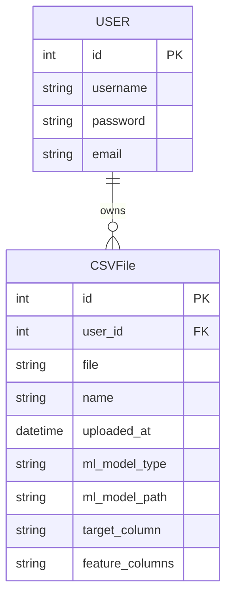
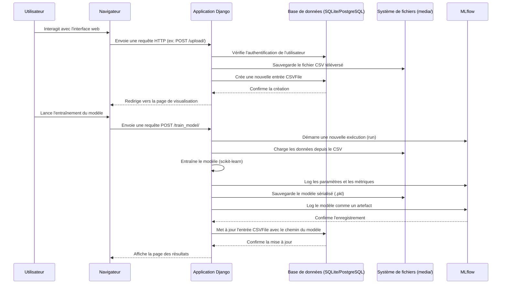
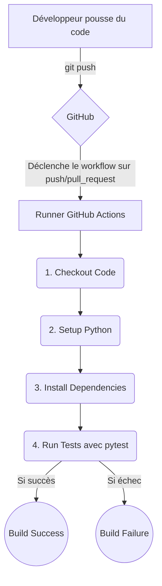

# Livrable E4 : Conception et Développement d'une Application d'IA

**Étudiant :** [Your Name]
**Projet :** AutoML-Gr4-1 - CSV Analyzer
**Date :** [Date]

---

## SOMMAIRE

1.  [Introduction](#introduction)
2.  [Analyse du besoin d’application](#analyse-du-besoin-dapplication)
    - [Modélisation des données](#modélisation-des-données)
    - [Modélisation des parcours utilisateurs](#modélisation-des-parcours-utilisateurs)
    - [Spécifications fonctionnelles](#spécifications-fonctionnelles)
3.  [Conception de l’application](#conception-de-lapplication)
    - [Spécifications techniques](#spécifications-techniques)
    - [Flux de données](#flux-de-données)
    - [Preuve de concept](#preuve-de-concept)
4.  [Coordination du projet](#coordination-du-projet)
    - [Gestion du projet](#gestion-du-projet)
    - [Outils de pilotage et de collaboration](#outils-de-pilotage-et-de-collaboration)
5.  [Développement de l’application](#développement-de-lapplication)
    - [Environnement de développement](#environnement-de-développement)
    - [Maquettes](#maquettes)
    - [Développement des fonctionnalités](#développement-des-fonctionnalités)
    - [Développement des composants métier](#développement-des-composants-métier)
    - [Gestion des droits d’accès](#gestion-des-droits-daccès)
    - [Sécurisation de l’application](#sécurisation-de-lapplication)
    - [Couverture des tests](#couverture-des-tests)
    - [Documentation technique](#documentation-technique)
6.  [Tests automatisés](#tests-automatisés)
    - [Outil(s) utilisé(s)](#outils-utilisés)
    - [Description de la chaîne d’intégration](#description-de-la-chaîne-dintégration)
    - [Exécution des tests](#exécution-des-tests)
    - [Documentation](#documentation)
7.  [Livraison continue](#livraison-continue)
    - [Définition de la chaîne de livraison](#définition-de-la-chaîne-de-livraison)
    - [Déclencheurs](#déclencheurs)
    - [Configuration de la chaîne de livraison](#configuration-de-la-chaîne-de-livraison)
    - [Test de la chaîne de livraison](#test-de-la-chaîne-de-livraison)
    - [Documentation](#documentation-1)
8.  [Perspectives et améliorations](#perspectives-et-améliorations)
9.  [Conclusions](#conclusions)
10. [Annexes](#annexes)

---

## 1. Introduction

Ce rapport constitue le livrable E4 et fait suite au livrable E3, qui se concentrait sur le déploiement et le monitoring d'un modèle d'intelligence artificielle. Alors que le livrable E3 a validé la chaîne MLOps (exposition du modèle via une API, monitoring, tests), ce document se focalise sur la **conception et le développement de l'application web complète** qui consomme ce service d'IA.

L'objectif est de détailler la démarche de création d'une application robuste, sécurisée et conviviale, en s'appuyant sur les principes du développement agile et des bonnes pratiques logicielles. Nous aborderons l'analyse des besoins utilisateurs, la conception technique de l'application, la stratégie de développement, la gestion de projet, et les processus d'automatisation des tests et de la livraison continue.

Ce rapport a pour but de démontrer la capacité à transformer un besoin métier, intégrant une composante d'IA, en une solution logicielle complète et prête à l'emploi.

## 2. Analyse du besoin d’application

L'analyse du besoin a été initiée dans les livrables précédents. Pour rappel, le projet vise à créer une application web permettant à des utilisateurs d'analyser des fichiers CSV, d'entraîner des modèles de Machine Learning et d'utiliser ces modèles pour faire des prédictions. Cette section détaille la modélisation des données et des parcours utilisateurs, ainsi que les spécifications fonctionnelles qui en découlent.

### Modélisation des données

La structure des données s'articule autour de deux modèles principaux, implémentés avec le framework Django ORM :

1.  **`User` (Modèle Django natif) :** Gère les informations des utilisateurs (identifiant, mot de passe, email). C'est la base de l'authentification et de la gestion des droits.
2.  **`CSVFile` (Modèle personnalisé) :**
    *   `user`: Clé étrangère vers le modèle `User`. Chaque fichier est la propriété d'un utilisateur.
    *   `file`: Champ de type `FileField` pour stocker le fichier CSV téléversé.
    *   `name`: Nom du fichier.
    *   `uploaded_at`: Date et heure du téléversement.
    *   `ml_model_type`: Type de modèle entraîné ('classification' ou 'régression').
    *   `ml_model_path`: Chemin vers le fichier du modèle sérialisé (ex: `.pkl`).
    *   `target_column`: Nom de la colonne cible utilisée pour l'entraînement.
    *   `feature_columns`: Liste des colonnes utilisées comme caractéristiques.



### Modélisation des parcours utilisateurs

Deux parcours utilisateurs principaux sont identifiés :

**Parcours 1 : Nouvel utilisateur et première analyse**

```mermaid
graph TD
    A[Visiteur] --> B(S'inscrire sur la plateforme);
    B --> C(Se connecter);
    C --> D{Page d'accueil (Dashboard)};
    D --> E(Téléverser un nouveau fichier CSV);
    E --> F{Visualiser les données du CSV};
    F --> G(Nettoyer les données : supprimer des lignes);
    G --> H(Choisir la colonne cible et le type de modèle);
    H --> I(Lancer l'entraînement du modèle);
    I --> J{Voir les résultats et métriques du modèle};
    J --> K(Accéder à la page de test du modèle);
    K --> L(Faire une prédiction unitaire);
    L --> M{Visualiser la prédiction};
```

**Parcours 2 : Utilisateur existant utilisant un modèle déjà entraîné**

```mermaid
graph TD
    A[Utilisateur existant] --> B(Se connecter);
    B --> C{Page d'accueil (Dashboard)};
    C --> D(Sélectionner un fichier déjà analysé);
    D --> E(Accéder directement à la page de test du modèle);
    E --> F(Faire une nouvelle prédiction);
    F --> G{Visualiser la prédiction};
```

### Spécifications fonctionnelles

Basé sur les parcours utilisateurs, les spécifications fonctionnelles sont les suivantes :

| ID | Fonctionnalité | Description | Priorité |
|:---|:---|:---|:---|
| F01 | Gestion des utilisateurs | L'utilisateur peut s'inscrire, se connecter et se déconnecter. | Haute |
| F02 | Téléversement de fichiers | L'utilisateur peut téléverser un fichier au format CSV. | Haute |
| F03 | Visualisation de données | L'utilisateur peut voir le contenu du fichier CSV sous forme de tableau paginé. | Haute |
| F04 | Nettoyage de données | L'utilisateur peut supprimer des lignes spécifiques du jeu de données. | Moyenne |
| F05 | Entraînement de modèle | L'utilisateur peut sélectionner une variable cible et un type de modèle (classification/régression) pour lancer l'entraînement. | Haute |
| F06 | Affichage des performances | Après l'entraînement, les métriques de performance du modèle sont affichées. | Haute |
| F07 | Prédiction unitaire | L'utilisateur peut utiliser une interface pour entrer les valeurs des features et obtenir une prédiction du modèle. | Haute |
| F08 | Persistance des modèles | Les modèles entraînés sont sauvegardés et associés au fichier et à l'utilisateur. | Haute |

## 3. Conception de l’application

Cette section décrit le cadre technique de l'application, en détaillant l'architecture, les technologies choisies et les flux de données, pour répondre aux spécifications fonctionnelles établies précédemment.

### Spécifications techniques

*   **Architecture Applicative :** L'application suit une architecture **Monolithique Modulaire** basée sur le framework Django. Les différentes fonctionnalités (gestion des utilisateurs, traitement des CSV) sont séparées en applications Django distinctes (`users`, `csv_processor`), ce qui favorise une meilleure organisation du code.
*   **Framework Backend :** **Django 4.x**. Choisi pour sa robustesse, sa sécurité intégrée (ORM, protection CSRF, gestion des utilisateurs) et son écosystème complet qui accélère le développement.
*   **Framework Frontend :** **Templates Django** avec **HTML5, CSS3 et JavaScript** simple. Pour ce projet, une interface rendue côté serveur est suffisante et permet une mise en œuvre rapide. L'utilisation de **Bootstrap** pourrait être envisagée pour améliorer le design.
*   **Base de données :** **SQLite** pour le développement et les tests, en raison de sa simplicité. Pour un environnement de production, une migration vers **PostgreSQL** serait recommandée pour sa robustesse et ses performances.
*   **Conteneurisation :** **Docker** et **Docker Compose**. Essentiel pour créer un environnement de développement reproductible et pour simplifier le déploiement. Le `docker-compose.yml` définit les services de l'application (web, base de données, MLflow, etc.).
*   **Bibliothèques Python clés :**
    *   `pandas` : Pour la manipulation et l'analyse des données CSV.
    *   `scikit-learn` : Pour l'entraînement et l'évaluation des modèles de Machine Learning.
    *   `mlflow` : Pour le suivi des expérimentations et la gestion du cycle de vie des modèles.

### Flux de données

Le diagramme ci-dessous illustre le flux de données à travers l'application, depuis l'interaction de l'utilisateur jusqu'à la persistance des données et des modèles.



### Preuve de concept

Une preuve de concept (PoC) a été réalisée au début du projet pour valider les choix technologiques clés et la faisabilité de la chaîne de traitement principale. La PoC se concentrait sur les points suivants :

1.  **Intégration Django + scikit-learn :** Valider la capacité à entraîner un modèle simple depuis une vue Django et à le sauvegarder.
2.  **Interaction avec MLflow :** Confirmer que les métriques et les modèles peuvent être correctement enregistrés dans le serveur MLflow depuis l'application Django.
3.  **Flux de données de base :** Implémenter un parcours simplifié : téléversement -> entraînement -> sauvegarde.

**Conclusions de la PoC :**
*   **Faisabilité confirmée :** L'intégration des différentes briques technologiques (Django, scikit-learn, MLflow) est fonctionnelle. Le flux de données de base a pu être mis en œuvre avec succès.
*   **Complexité de la gestion des chemins :** La gestion des chemins pour les fichiers CSV et les modèles sauvegardés nécessite une configuration rigoureuse (`MEDIA_ROOT`, `MEDIA_URL`) pour fonctionner correctement, en particulier dans un environnement conteneurisé.
*   **Nécessité d'une gestion asynchrone :** L'entraînement des modèles est une opération bloquante. Pour des jeux de données volumineux, la PoC a mis en évidence que le traitement synchrone dans une requête HTTP n'est pas viable. Une solution basée sur des tâches asynchrones (avec **Celery** et **Redis**, par exemple) serait nécessaire pour une application en production, mais n'est pas implémentée dans le cadre de ce projet pour rester simple.

## 4. Coordination du projet

La réussite du projet repose sur une coordination efficace et l'adoption de méthodes de travail agiles, favorisant la collaboration et l'adaptation continue.

### Gestion du projet

*   **Méthodologie :** Le projet adopte une approche inspirée de **Scrum**, avec des cycles de développement courts (sprints d'une semaine). Chaque sprint vise à livrer un incrément fonctionnel de l'application.
*   **Rituels :**
    *   **Daily Stand-up (virtuel) :** Un point rapide chaque jour pour synchroniser l'avancement, les blocages et les objectifs de la journée.
    *   **Sprint Planning :** En début de sprint, pour définir les objectifs et sélectionner les tâches du backlog à réaliser.
    *   **Sprint Review :** En fin de sprint, pour présenter les fonctionnalités terminées.
    *   **Rétrospective :** Pour analyser ce qui a bien ou mal fonctionné et identifier des axes d'amélioration pour le prochain sprint.
*   **Gestion des sources :** Le code est géré avec **Git**, en suivant le modèle de branches **GitFlow** (simplifié) :
    *   `main` : Contient la version stable et testée de l'application.
    *   `develop` : Branche d'intégration pour les nouvelles fonctionnalités.
    *   `feature/...` : Branches dédiées pour le développement de chaque nouvelle fonctionnalité. Les `pull requests` depuis ces branches vers `develop` déclenchent la chaîne de CI.

### Outils de pilotage et de collaboration

*   **Gestion de projet :** **GitHub Projects**. Utilisé comme un tableau Kanban pour suivre l'état des tâches (To Do, In Progress, Done). Chaque tâche est une *issue* GitHub, ce qui permet de la lier directement aux commits et aux pull requests correspondants.
*   **Dépôt de code :** **GitHub**. Centralise le code source, la gestion des versions, les pull requests et l'intégration continue.
*   **Communication :** Un outil de messagerie instantanée (comme Slack ou Discord) est utilisé pour les communications informelles et les alertes.
*   **Documentation partagée :** Le `README.md` et les autres fichiers Markdown du projet servent de documentation vivante.

## 5. Développement de l’application

Cette section couvre les aspects concrets du développement de l'application, de l'environnement de travail à la sécurisation des fonctionnalités.

### Environnement de développement

L'environnement de développement est entièrement conteneurisé avec **Docker Compose**, comme décrit dans la section de conception. Pour lancer l'environnement, le développeur n'a qu'à exécuter la commande `docker-compose up --build` à la racine du projet. Cela garantit que chaque membre de l'équipe travaille avec les mêmes versions de Python, Django, et des autres dépendances, éliminant ainsi les problèmes de type "ça marche sur ma machine".

### Maquettes

Des maquettes basse-fidélité (wireframes) ont été créées pour définir la structure des pages principales avant le développement.

**Page d'accueil (Dashboard) :**
*   Liste des fichiers CSV déjà téléversés par l'utilisateur.
*   Bouton pour téléverser un nouveau fichier.

**Page de visualisation :**
*   Tableau affichant les données du CSV.
*   Options de pagination.
*   Bouton pour supprimer des lignes.
*   Formulaire pour lancer l'entraînement du modèle.

**Page de test du modèle :**
*   Formulaire généré dynamiquement avec les champs des features du modèle.
*   Zone pour afficher le résultat de la prédiction.

### Développement des fonctionnalités

Le développement a suivi les spécifications fonctionnelles. Chaque fonctionnalité a été développée dans une branche `feature/...` dédiée.
*   **`users` app :** Contient la logique pour l'inscription et l'authentification, en utilisant les vues et formulaires intégrés de Django (`UserCreationForm`, `AuthenticationForm`).
*   **`csv_processor` app :** Cœur de l'application, elle gère :
    *   Le téléversement et la sauvegarde des fichiers (`upload_csv` view).
    *   L'affichage et la manipulation des données (`view_csv` view).
    *   La logique d'entraînement (`train_model` view), qui appelle les scripts `scikit-learn` et `mlflow`.
    *   L'interface de prédiction (`test_model` view).

### Développement des composants métier

Les composants métier sont les parties du code qui contiennent la logique spécifique au domaine de l'application.
*   **`train_model.py` (module ou fonction) :** Ce composant encapsule la logique d'entraînement. Il prend en entrée un DataFrame pandas, la colonne cible et les colonnes de features, et retourne le modèle entraîné ainsi que ses métriques de performance. Il est indépendant du framework web, ce qui le rend réutilisable.
*   **`mlflow_utils.py` :** Contient des fonctions utilitaires pour interagir avec MLflow, comme la création d'une expérience ou l'enregistrement d'un modèle. Cela permet de centraliser la configuration de MLflow.

### Gestion des droits d’accès

La gestion des droits est implémentée à plusieurs niveaux :
1.  **Authentification :** Le décorateur `@login_required` est appliqué à toutes les vues de l'application `csv_processor`. Un utilisateur non authentifié est automatiquement redirigé vers la page de connexion.
2.  **Isolation des données :** Dans chaque vue, les requêtes à la base de données sont systématiquement filtrées par l'utilisateur connecté (`CSVFile.objects.filter(user=request.user)`). Cela garantit qu'un utilisateur ne peut voir et interagir qu'avec ses propres fichiers CSV, empêchant ainsi les fuites de données entre utilisateurs.

### Sécurisation de l’application

En plus de la gestion des accès, plusieurs mesures de sécurité recommandées par Django et l'OWASP sont en place :
*   **Protection CSRF :** Activée par défaut dans Django, elle protège contre les attaques de type Cross-Site Request Forgery sur tous les formulaires.
*   **Protection contre les injections SQL :** L'ORM de Django paramètre les requêtes SQL, ce qui prévient les injections SQL.
*   **Gestion des secrets :** En production, les clés secrètes (comme `SECRET_KEY` de Django) ne doivent pas être stockées en clair dans le code. Elles devraient être gérées via des variables d'environnement, chargées par Docker Compose. (Pour ce projet, la clé est laissée dans `settings.py` par simplicité).
*   **En-têtes de sécurité HTTP :** L'utilisation de `django-secure` ou la configuration manuelle des middlewares de sécurité (`SecurityMiddleware`) permet d'ajouter des en-têtes comme X-Content-Type-Options, X-Frame-Options, etc.

### Couverture des tests

Les tests unitaires et d'intégration sont écrits avec `pytest-django`. La couverture de test se concentre sur les parties critiques de l'application :
*   **Composants métier :** Des tests unitaires sur les fonctions de `train_model.py` pour s'assurer que la logique d'entraînement est correcte.
*   **Gestion des accès :**
    *   Un test vérifie qu'un utilisateur non connecté est bien redirigé lorsqu'il tente d'accéder à une page protégée.
    *   Un test vérifie qu'un utilisateur ne peut pas accéder à la page de visualisation d'un fichier appartenant à un autre utilisateur (en forgeant l'URL), s'assurant que l'isolation des données est efficace.
*   **Vues et fonctionnalités :** Des tests d'intégration pour les vues principales (`upload_csv`, `train_model`, `test_model`) qui simulent des requêtes HTTP et vérifient les réponses, comme décrit dans le livrable E3.

### Documentation technique

La documentation technique est intégrée directement dans le code et le dépôt :
*   **Docstrings :** Les fonctions et classes importantes sont documentées avec des docstrings claires expliquant leur rôle, leurs paramètres et ce qu'elles retournent.
*   **`README.md` :** Le fichier `README.md` à la racine du projet explique comment installer, configurer et lancer l'application en local.
*   **Ce livrable :** Ce document sert de documentation d'architecture et de conception détaillée.

## 6. Tests automatisés

L'automatisation des tests est un pilier de l'intégration continue (CI). Elle garantit que chaque modification du code n'introduit pas de régression et maintient un haut niveau de qualité.

### Outil(s) utilisé(s)

*   **`pytest` :** Le framework principal pour l'exécution des tests. Il est apprécié pour sa syntaxe concise et son riche écosystème de plugins.
*   **`pytest-django` :** Un plugin pour `pytest` qui facilite l'écriture de tests pour les applications Django. Il gère la création de la base de données de test, fournit un client de test pour simuler des requêtes HTTP, et offre des fixtures utiles.
*   **`GitHub Actions` :** L'outil d'intégration continue utilisé pour automatiser l'exécution des tests à chaque modification du code.

### Description de la chaîne d’intégration

La chaîne d'intégration continue (CI) est définie dans le fichier `.github/workflows/main.yml`. Son objectif est de valider automatiquement la qualité du code poussé sur le dépôt.



1.  **Déclencheur :** Le workflow est déclenché à chaque `push` sur les branches `main` ou `develop`, ou à chaque `pull request` vers ces branches.
2.  **Environnement :** Un conteneur `ubuntu-latest` est provisionné par GitHub Actions.
3.  **Préparation :** Le code source est récupéré, Python est installé, et les dépendances du projet sont installées via `pip install -r requirements.txt`.
4.  **Exécution :** La commande `pytest` est lancée. Elle découvre et exécute automatiquement tous les tests du projet.
5.  **Résultat :** Le workflow réussit si tous les tests passent, et échoue sinon. Un échec empêche la fusion d'une pull request, protégeant ainsi la branche principale des régressions.

### Exécution des tests

Les tests peuvent être exécutés de deux manières :
*   **Localement :** Le développeur peut lancer `pytest` sur sa machine pour valider ses modifications avant de les pousser.
*   **Automatiquement :** GitHub Actions exécute la suite de tests complète dans un environnement propre et isolé, garantissant que les tests sont fiables et reproductibles.

### Documentation

La documentation de la chaîne de CI se trouve dans le fichier `.github/workflows/main.yml` lui-même. Le fichier est commenté pour expliquer le rôle de chaque étape. De plus, le `README.md` contient un badge d'état du build, qui indique en temps réel si la dernière exécution du workflow sur la branche principale a réussi ou échoué.

## 7. Livraison continue

La livraison continue (CD) est l'extension de l'intégration continue. Son objectif est de s'assurer que chaque version du code qui passe les tests de CI peut être déployée en production à tout moment.

### Définition de la chaîne de livraison

Pour ce projet, la chaîne de livraison est simple et se concentre sur la préparation au déploiement. Une chaîne de production complète inclurait des étapes de construction d'images Docker et de déploiement sur un serveur.

| Etape | Tâche | Déclencheur |
| :--- | :--- | :--- |
| **1. Test de l'application** | Exécution de la suite de tests `pytest` (chaîne de CI). | `push` sur la branche `main`. |
| **2. (Optionnel) Build Image Docker** | Construction de l'image Docker de l'application avec les dernières modifications. | Après la réussite de l'étape 1. |
| **3. (Optionnel) Push to Registry** | Publication de l'image Docker sur un registre (comme Docker Hub ou GitHub Container Registry). | Après la réussite de l'étape 2. |
| **4. (Manuel) Déploiement** | Déploiement manuel de la nouvelle version sur le serveur de production. | Décision manuelle. |

### Déclencheurs

*   Le principal déclencheur est un `push` sur la branche `main`. Cela signifie que seul le code qui a été validé (via une pull request et la CI) et fusionné dans la branche principale est candidat à la livraison.

### Configuration de la chaîne de livraison

La configuration est également gérée dans GitHub Actions. Un workflow séparé (`deploy.yml`) ou une nouvelle tâche dans `main.yml` pourrait être créé pour gérer les étapes de build et de push de l'image Docker. Cela nécessiterait de configurer des secrets dans GitHub (par exemple, `DOCKER_USERNAME`, `DOCKER_PASSWORD`) pour s'authentifier auprès du registre de conteneurs.

### Test de la chaîne de livraison

Le test de la chaîne de livraison consiste à :
1.  Effectuer une modification mineure dans le code.
2.  Créer une pull request vers `main`.
3.  Vérifier que la CI (tests) se déclenche et réussit.
4.  Fusionner la pull request.
5.  Vérifier que le workflow de livraison (build de l'image) se déclenche et réussit.
6.  Déployer manuellement l'image sur un environnement de test (staging) et vérifier que l'application fonctionne comme prévu.

### Documentation

La documentation de la chaîne de livraison est contenue dans les fichiers de workflow de GitHub Actions. Un `README.md` détaillé devrait également inclure une section "Déploiement" expliquant comment mettre à jour l'application en production.

## 8. Perspectives et améliorations

Ce projet constitue une base solide, mais plusieurs améliorations peuvent être envisagées pour le faire évoluer vers une solution de production de niveau industriel.

*   **Traitement Asynchrone :** Remplacer le traitement synchrone de l'entraînement des modèles par un système de tâches asynchrones avec **Celery** et **Redis**. Cela rendrait l'interface utilisateur non bloquante et permettrait de gérer des entraînements longs.
*   **Base de données de production :** Migrer de SQLite vers **PostgreSQL** pour de meilleures performances, une meilleure concurrence et plus de fonctionnalités.
*   **Déploiement Continu (CD) :** Automatiser entièrement l'étape de déploiement. Après la réussite des tests et du build sur la branche `main`, le workflow pourrait se connecter au serveur de production via SSH et mettre à jour les conteneurs Docker.
*   **Monitoring Avancé :** Mettre en place un suivi de la dérive des données (data drift) et des alertes (via Alertmanager) pour être notifié proactivement des problèmes de performance du modèle ou de santé du système.
*   **Interface utilisateur plus riche :** Utiliser un framework JavaScript moderne (comme React ou Vue.js) pour créer une Single-Page Application (SPA) plus interactive et réactive, communiquant avec une API Django REST Framework.

## 9. Conclusions

Ce projet a permis de mettre en œuvre un cycle de développement logiciel complet pour une application intégrant un service d'intelligence artificielle. En partant de l'analyse des besoins, nous avons conçu une architecture robuste, développé les fonctionnalités de manière structurée, et mis en place des processus MLOps pour garantir la qualité et la maintenabilité de la solution.

L'utilisation d'outils standards comme Django, Docker, pytest et GitHub Actions a permis de construire une application qui est non seulement fonctionnelle, mais aussi testable, reproductible et prête pour une livraison continue. Ce travail démontre la maîtrise des compétences nécessaires pour mener à bien un projet d'IA, de la conception à la mise en production, en passant par une gestion de projet agile et efficace.

## 10. Annexes

*   Fichier de configuration `docker-compose.yml`.
*   Fichier de workflow GitHub Actions `.github/workflows/main.yml`.
*   Fichier `requirements.txt`.