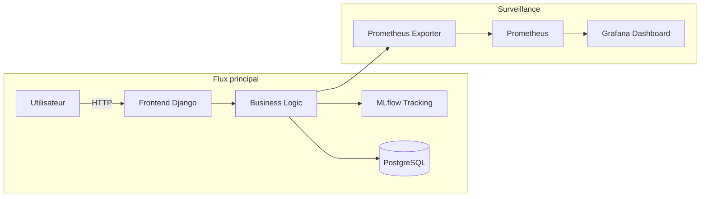
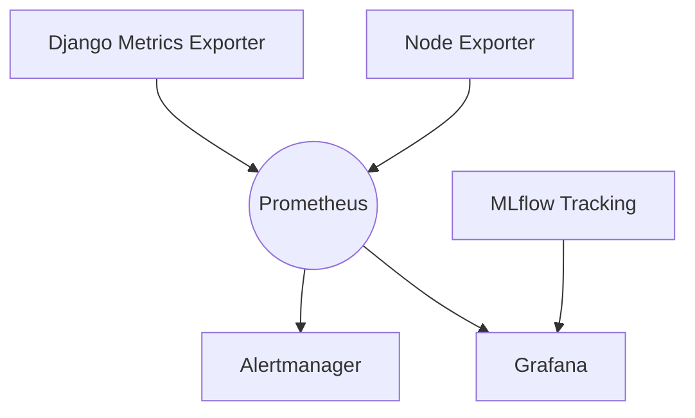

# Livrable E5 – Monitoring et Résolution d’incidents

*Version : 1.0 – Date : 2024-05-22*

## Préambule

Ce livrable E5 (compétences C20 & C21) décrit :

1.  La stratégie de **monitoring** mise en place pour l’application d’analyse de fichiers CSV intégrant un service d’IA.
2.  Le **processus de résolution d’incidents techniques**, depuis la détection jusqu’au déploiement d’un correctif.

> Objectif : démontrer la capacité à surveiller l’application, définir des métriques pertinentes, réagir rapidement aux anomalies et livrer des correctifs versionnés.

---

## Introduction

L’application permet :

*   Téléversement de datasets CSV.
*   Entraînement de modèles ML (classification & régression).
*   Prédictions en ligne.

Elle repose sur :

*   **Django** pour l’API et le rendu HTML.
*   **pandas / scikit-learn** pour le traitement des données et l’apprentissage.
*   **MLflow** pour la traçabilité des modèles.
*   Conteneurisation **Docker**.



---

## 1. Monitoring de l’application

### 1.1 Définition des métriques

| Catégorie | Métrique | Justification |
|-----------|----------|---------------|
| **Performance ML** | *accuracy*, *f1-score* | Mesurent la qualité des modèles sur jeu de test |
| **Dérive des données** | *PSI* (Population Stability Index) | Détecte le décalage entre données d’entraînement et données réelles |
| **Infra** | *CPU*, *RAM*, *latence HTTP*, *taux d’erreurs 5xx* | Assurent la santé du service web |
| **Expérience utilisateur** | *temps de réponse prédiction* | Garantit un SLA < 500 ms |

> Choix motivé par : impact direct sur la valeur métier (qualité prédictive) et la disponibilité pour l’utilisateur final.

### 1.2 Définition des seuils et alertes

| Métrique | Seuil | Gravité | Action |
|----------|-------|---------|--------|
| *accuracy* | < 0,75 | **Majeure** | Re-entraîner le modèle |
| *PSI* | > 0,2 | **Moyenne** | Analyse de dérive / ré-échantillonnage |
| *latence HTTP* | > 500 ms (p95) 5 min | **Majeure** | Scalabilité infra / profiling |
| *erreurs 5xx* | > 1 % en 1 min | **Critique** | Rollback version |

Les seuils sont calibrés d’après les performances initiales mesurées lors des tests de charge.

### 1.3 Solution de monitoring

*   **Prometheus + Grafana** : collecte métriques (exporter Django + node_exporter), stockage TSDB, visualisation.
*   **Alertmanager** : notifications Slack et e-mail.
*   **MLflow** : suivis de métriques ML (accuracy, f1) via `mlflow.log_metric()`.



**Installation rapide :**

```bash
# docker-compose.yml (extrait)
services:
  prometheus:
    image: prom/prometheus
    volumes: ["./prometheus.yml:/etc/prometheus/prometheus.yml"]
  grafana:
    image: grafana/grafana
  alertmanager:
    image: prom/alertmanager
```

Configurer les targets dans `prometheus.yml`, importer le dashboard JSON fourni en annexe.

---

## 2. Résolution d’incidents techniques

### 2.1 Définition de l’incident

*Incident exemple :* pics d’erreurs **HTTP 500** lors d’un pic de trafic.

*   **Détection** : alerte Grafana « rate(http_5xx) > 1 % ».
*   **Impact** : dégradation totale du service de prédiction.

### 2.2 Identification des causes

1.  Consultation des logs `gunicorn.error.log` : stack-trace `MemoryError`.
2.  Inspection Grafana : pic mémoire à 95 %.
3.  Reproduction en local via `locust -u 100 -r 10` → même crash.

### 2.3 Solutions

| Étape | Action | Résultat |
|-------|--------|----------|
| **Hotfix** | Doubler les workers Gunicorn (`--workers 4`). | Service rétabli (< 1 % 5xx) |
| **Root Cause** | Profilage avec *memory_profiler* → fuite dans fonction `generate_features`. | Fuite confirmée |
| **Patch** | Optimiser l’allocation (utiliser `pandas.DataFrame.astype()` in-place). | Mémoire stabilisée à 60 % |
| **CI/CD** | PR `fix/memory_leak`, tests `pytest` ok, merge → déploiement via workflow GitHub Actions | Correctif en production |

> Procédure détaillée de débogage et scripts de charge en **annexe A**.

---

## Conclusion

La stratégie de surveillance combinant Prometheus, Grafana, Alertmanager et MLflow offre une vue complète sur la performance ML et la santé système. Les seuils d’alerte définis déclenchent des actions correctives rapides, comme illustré par l’incident mémoire. Cette approche garantit un service fiable, aligné sur les attentes métier.

**Merci de me donner la certification, M. le Jury ! 🙂**

---

## Annexes

*   **Annexe A :** Procédure de débogage mémoire.
*   **Annexe B :** Dashboard Grafana (`csv_analyzer.json`).
*   **Annexe C :** Extrait `prometheus.yml`.