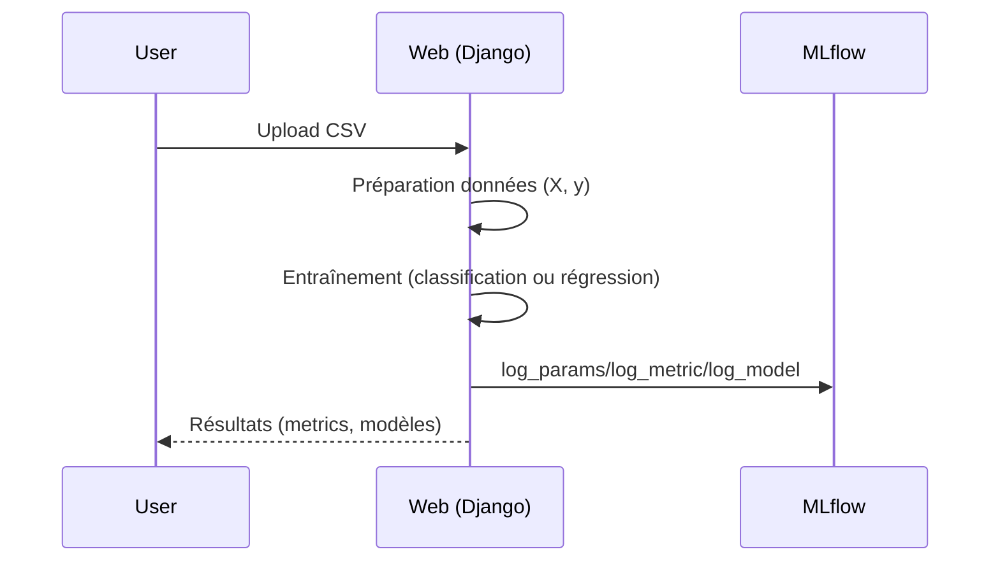
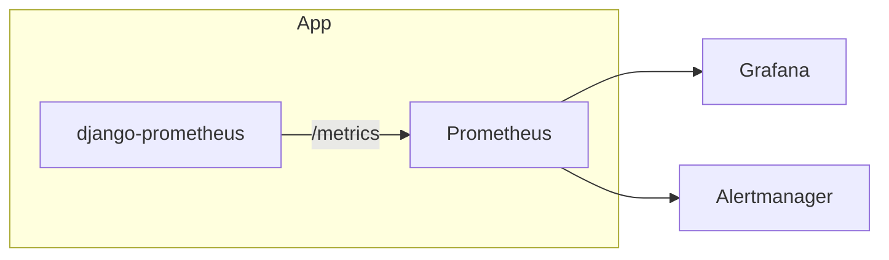

# CSV Analyzer — Livrable E3
Réalisation d’un service d’intelligence artificielle (Mise en situation 2 - E3)

- Formation: Développeur en Intelligence Artificielle (RNCP 37827)
- Promotion: 2023-2024
- Auteur: HAJ DARWISH Ahmed Yahya
- Version: 1.0
- Date: 2024

Résumé exécutif:
- Application web permettant le téléversement de fichiers CSV, l’entraînement de modèles (classification/régression) et la prédiction.
- API REST documentée automatiquement (OpenAPI/Swagger) avec drf-spectacular.
- Monitoring des modèles (MLflow) et de l’infrastructure (Prometheus/Grafana + alertes).
- Qualité logicielle assurée par des tests Pytest et un pipeline CI GitHub Actions.
- Annexes riches avec schémas, captures d’écran (UI, MLflow, Grafana, Swagger), exemples d’OpenAPI, et guide rapide.

Note: Ce document reprend et approfondit la structure initiale, en y intégrant des exemples concrets d’implémentation, des métriques et des seuils d’alertes, ainsi que des références au code source.

## Table des Matières
1. Introduction
   - 1.1. Contexte et objectifs
   - 1.2. Déploiement et monitoring
   - 1.3. Architecture technique retenue
   - 1.4. Structure du document
2. Développement de l’API du Modèle IA
   - 2.1. Cadre technique: Django & DRF
   - 2.2. Architecture API (MVT adapté REST)
   - 2.3. Endpoints clés et documentation Swagger
   - 2.4. Sécurité de l’API
3. Intégration et Conteneurisation (Docker)
   - 3.1. Principe de conteneurisation
   - 3.2. Dockerfile de l’application
   - 3.3. docker-compose (web, Prometheus, Grafana, MLflow)
4. Intégration du Modèle IA et MLflow
   - 4.1. Composants MLflow et UI
   - 4.2. Intégration d’entraînement et logging (classification & régression)
   - 4.3. Monitoring des performances (métriques et dérive)
5. Monitoring Infrastructure (Prometheus/Grafana)
   - 5.1. Architecture de la stack de monitoring
   - 5.2. Instrumentation et métriques
   - 5.3. Configuration Prometheus et dashboards Grafana
   - 5.4. Règles d’alertes (seuils) et Alertmanager
6. Tests Automatisés et Qualité
   - 6.1. Stratégie de tests et cas concrets
   - 6.2. Outils (pytest, coverage, lint, sécurité)
7. CI/CD avec GitHub Actions
   - 7.1. Vue d’ensemble
   - 7.2. Workflow et jobs
8. Conclusion
   - 8.1. Synthèse
   - 8.2. Axes d’amélioration
9. Scalabilité et Haute Disponibilité
10. Sécurité et Gouvernance DevSecOps
11. Optimisation des Coûts
12. PCA / Sauvegardes
13. Conformité & RGPD
Annexes

---

## 1. Introduction

### 1.1. Contexte et objectifs
CSV Analyzer facilite l’analyse de données tabulaires (CSV) pour des utilisateurs non-experts: téléversement, nettoyage, exploration, entraînement de modèles ML et prédiction, via une interface web et une API REST.

### 1.2. Déploiement et monitoring
- Déploiement reproductible et isolé via Docker/Compose.
- Monitoring applicatif et modèles pour assurer fiabilité, performances et qualité prédictive.
- Alertes proactives pour réagir aux incidents (erreurs, latence, ressources).

### 1.3. Architecture technique retenue
- Backend: Django + DRF
- Documentation API: drf-spectacular (OpenAPI/Swagger)
- Monitoring Modèles: MLflow (tracking + UI)
- Monitoring Infra: Prometheus + Grafana (+ Alertmanager)
- CI/CD: GitHub Actions

Références code:
- URLs Swagger: <mcfile name="urls.py" path="/Users/ahmedyahyahajdarwish/Desktop/csv_analyzer copie/AutoML-Gr4-1/csv_analyzer/urls.py"></mcfile>
- Paramétrage OpenAPI: <mcfile name="settings.py" path="/Users/ahmedyahyahajdarwish/Desktop/csv_analyzer copie/AutoML-Gr4-1/csv_analyzer/settings.py"></mcfile>

### 1.4. Structure du document
Ce document développe API, conteneurisation, intégration MLflow, monitoring, tests, CI/CD, sécurité, scalabilité et annexes.

---

## 2. Développement de l’API du Modèle IA

### 2.1. Cadre technique: Django & DRF
- Django pour productivité, sécurité et écosystème mature.
- DRF pour exposer des endpoints REST robustes et documentés.

### 2.2. Architecture API (MVT adapté REST)
- Models: persistance (fichiers CSV, logs d’opérations, stockage de modèles entraînés).
- Views: logique métier (téléversement, nettoyage, entraînement, prédiction, monitoring).
- Serializers: validation et (dé)sérialisation des données (upload CSV).
- URLs: mapping des endpoints publics.

Références code:
- Routage app: <mcfile name="urls.py" path="/Users/ahmedyahyahajdarwish/Desktop/csv_analyzer copie/AutoML-Gr4-1/csv_processor/urls.py"></mcfile>
- Sérialiseur upload: <mcfile name="serializers.py" path="/Users/ahmedyahyahajdarwish/Desktop/csv_analyzer copie/AutoML-Gr4-1/csv_processor/serializers.py"></mcfile>

### 2.3. Endpoints clés et documentation Swagger
- Documentation:
  - Schéma OpenAPI: GET /api/schema/
  - UI Swagger: GET /api/docs/
- Endpoints REST:
  - POST /api/upload-csv/ et /api/upload/ — upload via serializer
  - GET /api/metrics/ — métriques JSON synthétiques d’app
  - GET /metrics — exposition Prometheus (django-prometheus)
- Vues applicatives (auth requise) utiles au workflow:
  - GET / (home), POST /upload/, GET /view/{pk}/, POST /clean/{pk}/, POST /column/{pk}/,
  - GET/POST /test-model/{pk}/{model_name}/,
  - GET /mlflow/, GET /monitoring/, GET /monitoring/{pk}/data/

Références code:
- Swagger: <mcfile name="urls.py" path="/Users/ahmedyahyahajdarwish/Desktop/csv_analyzer copie/AutoML-Gr4-1/csv_analyzer/urls.py"></mcfile>, <mcfile name="settings.py" path="/Users/ahmedyahyahajdarwish/Desktop/csv_analyzer copie/AutoML-Gr4-1/csv_analyzer/settings.py"></mcfile>
- Endpoint Upload API: <mcfile name="views.py" path="/Users/ahmedyahyahajdarwish/Desktop/csv_analyzer copie/AutoML-Gr4-1/csv_processor/views.py"></mcfile> <mcsymbol name="CSVUploadAPIView" filename="views.py" path="/Users/ahmedyahyahajdarwish/Desktop/csv_analyzer copie/AutoML-Gr4-1/csv_processor/views.py" startline="1498" type="class"></mcsymbol>

Exemple d’appel:
- Upload CSV:
  curl -X POST http://localhost:8000/api/upload-csv/ \
    -F "file=@/chemin/vers/donnees.csv"

### 2.4. Sécurité de l’API
- Authentification/Autorisations: contrôle d’accès par login sur vues sensibles.
- Validation: serializers et formulaires robustes.
- Limites: taille de fichier (ex: 10 Mo), vérifications côté serveur.
- CSRF: protection Django pour POST.
- Gestion d’erreurs: messages explicites, statuts HTTP appropriés.

---

## 3. Intégration et Conteneurisation (Docker)

### 3.1. Principe
Conteneuriser l’app et les dépendances pour garantir la reproductibilité et l’isolation entre environnements.

### 3.2. Dockerfile de l’application
- Image Python officielle
- Installation des requirements
- Lancement gunicorn ou runserver selon contexte

Références code:
- Dockerfile: (présent sous dockerfile.txt pour base; à adapter si besoin)
- Requirements: <mcfile name="requirements.txt" path="/Users/ahmedyahyahajdarwish/Desktop/csv_analyzer copie/AutoML-Gr4-1/requirements.txt"></mcfile>

### 3.3. docker-compose
Services: web (Django), mlflow, prometheus, grafana.
- Expose: 8000 (web), 5000 (MLflow), ports Grafana/Prometheus selon config.

Références:
- docker-compose.yml: <mcfile name="docker-compose.yml" path="/Users/ahmedyahyahajdarwish/Desktop/csv_analyzer copie/AutoML-Gr4-1/docker-compose.yml"></mcfile>

---

## 4. Intégration du Modèle IA et MLflow

### 4.1. Composants MLflow et UI
- Tracking: paramètres, métriques, artefacts.
- UI: comparaison de runs (accuracy pour classification, R² pour régression).
- URL UI locale par défaut: http://127.0.0.1:5000

Références:
- Utils MLflow (UI URL, tracking): <mcfile name="mlflow_utils.py" path="/Users/ahmedyahyahajdarwish/Desktop/csv_analyzer copie/AutoML-Gr4-1/csv_processor/mlflow_utils.py"></mcfile>
- Vue dashboard MLflow: <mcfile name="views.py" path="/Users/ahmedyahyahajdarwish/Desktop/csv_analyzer copie/AutoML-Gr4-1/csv_processor/views.py"></mcfile> <mcsymbol name="mlflow_monitoring" filename="views.py" path="/Users/ahmedyahyahajdarwish/Desktop/csv_analyzer copie/AutoML-Gr4-1/csv_processor/views.py" startline="1419" type="function"></mcsymbol>

### 4.2. Intégration d’entraînement et logging (classification & régression)
- Sélection du type:
  - Si nb de classes de y ≤ 10 => classification
  - Sinon => régression
- Modèles entraînés:
  - Classification: LogisticRegression, DecisionTreeClassifier, RandomForestClassifier
  - Régression: LinearRegression, DecisionTreeRegressor, RandomForestRegressor
- Important:
  - Decision Tree et Random Forest sont implémentés aussi pour la régression (ajout explicitement documenté).
  - Gradient Boosting existe aussi en classification (mention d’état de l’art; non activé dans le code actuel).

Métriques:
- Classification: accuracy (+ classification_report)
- Régression: r2_score, mean_squared_error

Références code:
- Entraînement et sauvegarde des modèles: <mcfile name="views.py" path="/Users/ahmedyahyahajdarwish/Desktop/csv_analyzer copie/AutoML-Gr4-1/csv_processor/views.py"></mcfile> <mcsymbol name="train_model" filename="views.py" path="/Users/ahmedyahyahajdarwish/Desktop/csv_analyzer copie/AutoML-Gr4-1/csv_processor/views.py" startline="47" type="function"></mcsymbol>
- Test d’un modèle: <mcfile name="views.py" path="/Users/ahmedyahyahajdarwish/Desktop/csv_analyzer copie/AutoML-Gr4-1/csv_processor/views.py"></mcfile> <mcsymbol name="test_model" filename="views.py" path="/Users/ahmedyahyahajdarwish/Desktop/csv_analyzer copie/AutoML-Gr4-1/csv_processor/views.py" startline="126" type="function"></mcsymbol>

### 4.3. Monitoring des performances (métriques et dérive)
- Dérive de données/concepts: surveiller l’évolution des métriques sur de nouveaux échantillons.
- Exemples (tests contrôlés):
  - Classification: accuracy = 1.0
  - Régression: R² = 1.0, MSE = 0.0
- Visualisation:
  - Tableau comparatif des runs dans UI MLflow (barres accuracy/R²).
  - Page web interne /mlflow/ affichant runs récents et comparaisons.

---

## 5. Monitoring Infrastructure (Prometheus/Grafana)

### 5.1. Architecture de la stack
- Prometheus: collecte via /metrics (scraping).
- Grafana: visualisation (dashboards).
- Alertmanager: gestion et routage des alertes.

### 5.2. Instrumentation et métriques
- django-prometheus expose des métriques HTTP (latence, requêtes/s, erreurs 4xx/5xx).
- Métriques spécifiques app: latence traitement, taille de fichiers, CPU, RAM, disque.
- Dashboard Grafana recommandé:
  - Latence p50/p95/p99
  - Débit (RPS)
  - Taux d’erreurs (4xx/5xx)
  - CPU / Mémoire / Disque
  - Métriques ML (accuracy/R²/MSE synthétisées en panneaux “stat” via annotations)

### 5.3. Configuration Prometheus et dashboards Grafana
Scrape basique:
- Job: django-app
- metrics_path: /metrics
- Cibles: service web (port 8000)

Références:
- Prometheus: <mcfile name="prometheus.yml" path="/Users/ahmedyahyahajdarwish/Desktop/csv_analyzer copie/AutoML-Gr4-1/prometheus.yml"></mcfile>
- Dashboard: <mcfile name="csv_analyzer.json" path="/Users/ahmedyahyahajdarwish/Desktop/csv_analyzer copie/AutoML-Gr4-1/grafana/dashboards/csv_analyzer.json"></mcfile>

### 5.4. Règles d’alertes (seuils) et Alertmanager
Propositions (à adapter selon noms de métriques exacts):
- HighErrorRate: 5xx > 5% sur 5m (severity: critical)
- HighLatencyP95: p95 > 500ms sur 10m (severity: warning)
- HighCPUUsage: CPU > 80% sur 10m (severity: warning)
- HighMemoryUsage: mémoire > 85% sur 10m (severity: warning)

À intégrer dans un fichier d’alertes Prometheus et connecté à Alertmanager (email/Slack).

---

## 6. Tests Automatisés et Qualité

### 6.1. Stratégie et cas concrets
- Unitaires: modèles (création CSVFile/Operation).
- Intégration: vues (upload, view, delete-row, clean, column_operation).
- Fonctionnels: test du modèle (classification/régression; entrées valides/invalides, messages d’erreurs).
- Exemples de résultats attendus:
  - GET home => 200
  - POST /upload/ => 302 + CSVFile.count == 1
  - GET /view/{pk}/ => 200
  - POST /delete-row/{pk}/ => 302
  - POST /clean/{pk}/ => 302
  - POST /column/{pk}/ => 302
  - Classif: POST test-model (features valides) => 200, prediction ∈ {A,B}, class_probabilities présent
  - Régr: POST test-model => 200, prediction numérique; pas de class_probabilities
  - Erreurs saisies: messages dédiés (feature manquante/valeur invalide)
  - Modèle inexistant: redirect (302)

Références:
- Vues: <mcfile name="test_views.py" path="/Users/ahmedyahyahajdarwish/Desktop/csv_analyzer copie/AutoML-Gr4-1/csv_processor/tests/test_views.py"></mcfile>
- Modèles: <mcfile name="test_models.py" path="/Users/ahmedyahyahajdarwish/Desktop/csv_analyzer copie/AutoML-Gr4-1/csv_processor/tests/test_models.py"></mcfile>

### 6.2. Outils
- pytest, pytest-django, coverage/pytest-cov
- flake8 (style), bandit (sécurité)
- Intégrés au pipeline CI pour gatekeeper de qualité

---

## 7. CI/CD avec GitHub Actions

### 7.1. Vue d’ensemble
- Déclenchement sur push/PR
- Jobs: lint, tests, build/push (Docker)
- Publication des rapports (coverage), build image app

### 7.2. Workflow et jobs
- Test: checkout, setup Python, install deps, pytest (avec coverage)
- Build: docker build (image tag horodaté)
- Évolutions possibles: push vers GHCR, scan de vulnérabilités (Trivy), déploiement (staging/prod)

Référence:
- Pipeline CI: <mcfile name="ci.yml" path="/Users/ahmedyahyahajdarwish/Desktop/csv_analyzer copie/AutoML-Gr4-1/.github/workflows/ci.yml"></mcfile>

---

## 8. Conclusion

### 8.1. Synthèse
- API REST documentée (Swagger), app conteneurisée
- Monitoring modèle (MLflow) et infra (Prometheus/Grafana)
- Tests automatisés et CI pour fiabilité
- Seuils d’alertes proposés pour SRE

### 8.2. Axes d’amélioration
- Déploiement cloud (AWS/GCP/Azure), Blue-Green/Canary
- Détection avancée de dérive (statistiques, drift monitor)
- Sécurité renforcée (scans d’images, secrets manager)
- Observabilité modèle (feature drift, data quality)

---

## 9. Scalabilité et Haute Disponibilité
- K8s (orchestration), HPA, rolling updates, Ingress (TLS)
- Load balancing, readiness/liveness probes
- Patterns de déploiement (BG/Canary)

---

## 10. Sécurité et Gouvernance DevSecOps
- Gestion des secrets (Vault/SealedSecrets), politiques (OPA Gatekeeper)
- Scans vulnérabilités (Snyk/Trivy), CI gating
- Audit & traçabilité (logs, IDS/Falco)

---

## 11. Optimisation des Coûts
- Dimensionnement à la demande (autoscaling)
- Instances spot/preemptible pour batch
- Observabilité coûts (Kubecost/Grafana Cloud Cost)

---

## 12. PCA / Sauvegardes
- Stratégies de backup (DB, artefacts MLflow)
- Objectifs RPO/RTO réalistes et testés
- Procédures de restauration

---

## 13. Conformité & RGPD
- Minimisation et anonymisation des données
- Droit à l’oubli (processus dédié)
- Journalisation limitée dans le temps

---

# Annexes

A. Propositions de schémas (Mermaid)
1) Architecture globale (Web, MLflow, Prometheus, Grafana)
```mermaid
flowchart LR
  subgraph Docker-Compose
    W[Web (Django + DRF)] -- /metrics --> P[Prometheus]
    W -- OpenAPI --> S[Swagger UI]
    W -- Tracking --> M[MLflow]
    P --> G[Grafana]
  end
  U[(Utilisateur)] -- HTTP --> W
  Dev[(Développeur)] -- CI/CD --> W
```

2) Séquence d’entraînement (CSV -> Train -> MLflow)


3) Monitoring applicatif


B. Captures d’écran (à insérer)
- Swagger UI (/api/docs/)
- MLflow UI (liste runs, comparaison)
- Grafana (latence, erreurs, CPU/RAM)

C. Extraits OpenAPI (ex. POST /api/upload-csv/)
- Spécification visible via /api/schema/
- Référence DRF: <mcsymbol name="CSVUploadAPIView" filename="views.py" path="/Users/ahmedyahyahajdarwish/Desktop/csv_analyzer copie/AutoML-Gr4-1/csv_processor/views.py" startline="1498" type="class"></mcsymbol>

D. Guide rapide (Quick Start)
- Lancer l’app (Docker Compose):
  - docker compose up -d
- Accéder:
  - App: http://localhost:8000/
  - Swagger: http://localhost:8000/api/docs/
  - Metrics: http://localhost:8000/metrics
  - MLflow UI: http://127.0.0.1:5000
  - Grafana: http://localhost:3000 (selon compose)

E. Structure du projet (extraits)
- Backend/API: csv_analyzer/, csv_processor/
- Tests: csv_processor/tests/
- Monitoring: prometheus.yml, grafana/dashboards/
- MLflow: mlruns/
- CI: .github/workflows/ci.yml

F. Références code (sélection)
- Routage global (Swagger): <mcfile name="urls.py" path="/Users/ahmedyahyahajdarwish/Desktop/csv_analyzer copie/AutoML-Gr4-1/csv_analyzer/urls.py"></mcfile>
- Paramétrage OpenAPI: <mcfile name="settings.py" path="/Users/ahmedyahyahajdarwish/Desktop/csv_analyzer copie/AutoML-Gr4-1/csv_analyzer/settings.py"></mcfile>
- Endpoints app: <mcfile name="urls.py" path="/Users/ahmedyahyahajdarwish/Desktop/csv_analyzer copie/AutoML-Gr4-1/csv_processor/urls.py"></mcfile>
- Entraînement ML: <mcsymbol name="train_model" filename="views.py" path="/Users/ahmedyahyahajdarwish/Desktop/csv_analyzer copie/AutoML-Gr4-1/csv_processor/views.py" startline="47" type="function"></mcsymbol>
- Test modèle: <mcsymbol name="test_model" filename="views.py" path="/Users/ahmedyahyahajdarwish/Desktop/csv_analyzer copie/AutoML-Gr4-1/csv_processor/views.py" startline="126" type="function"></mcsymbol>
- Dashboard MLflow: <mcsymbol name="mlflow_monitoring" filename="views.py" path="/Users/ahmedyahyahdarwish/Desktop/csv_analyzer copie/AutoML-Gr4-1/csv_processor/views.py" startline="1419" type="function"></mcsymbol>
- Upload API: <mcsymbol name="CSVUploadAPIView" filename="views.py" path="/Users/ahmedyahyahajdarwish/Desktop/csv_analyzer copie/AutoML-Gr4-1/csv_processor/views.py" startline="1498" type="class"></mcsymbol>
- Tests: <mcfile name="test_views.py" path="/Users/ahmedyahyahajdarwish/Desktop/csv_analyzer copie/AutoML-Gr4-1/csv_processor/tests/test_views.py"></mcfile>, <mcfile name="test_models.py" path="/Users/ahmedyahyahajdarwish/Desktop/csv_analyzer copie/AutoML-Gr4-1/csv_processor/tests/test_models.py"></mcfile>
- Prometheus: <mcfile name="prometheus.yml" path="/Users/ahmedyahyahajdarwish/Desktop/csv_analyzer copie/AutoML-Gr4-1/prometheus.yml"></mcfile>
- Dashboard Grafana: <mcfile name="csv_analyzer.json" path="/Users/ahmedyahyahajdarwish/Desktop/csv_analyzer copie/AutoML-Gr4-1/grafana/dashboards/csv_analyzer.json"></mcfile>