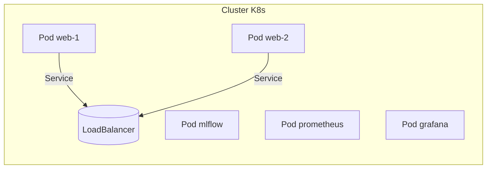

# Livrable E3 : Déploiement et Monitoring d'un Modèle IA pour l'Analyse de CSV

**Nom du Projet :** CSV Analyzer  
**Auteur :** Groupe 4  
**Date :** 24/07/2024  
**Version :** 1.0

---

## Table des Matières
1. [Introduction](#1-introduction)
   - 1.1. Contexte et Objectifs du Projet "CSV Analyzer"
   - 1.2. Importance du Déploiement et du Monitoring (Mise en Production)
   - 1.3. Présentation de la Solution Technique Retenue
   - 1.4. Structure du Document
2. [Développement de l'API du Modèle IA](#2-développement-de-lapi-du-modèle-ia)
   - 2.1. Choix du Framework : Django et Django REST Framework
   - 2.2. Architecture de l'API
   - 2.3. Implémentation des Endpoints Clés
   - 2.4. Sécurité de l'API
3. [Intégration et Conteneurisation avec Docker](#3-intégration-et-conteneurisation-avec-docker)
   - 3.1. Principe de la Conteneurisation
   - 3.2. Création du `Dockerfile` pour l'Application Django
   - 3.3. Orchestration avec `docker-compose.yml`
4. [Monitoring du Modèle avec MLflow](#4-monitoring-du-modèle-avec-mlflow)
   - 4.1. Introduction à MLflow et ses Composants
   - 4.2. Intégration de MLflow dans le Workflow
   - 4.3. Stratégie de Monitoring des Performances
5. [Monitoring de l'Infrastructure avec Prometheus et Grafana](#5-monitoring-de-linfrastructure-avec-prometheus-et-grafana)
   - 5.1. Architecture de la Stack de Monitoring
   - 5.2. Instrumentation de l'Application Django
   - 5.3. Configuration de Prometheus et Grafana
   - 5.4. Configuration des Alertes avec Alertmanager
6. [Tests Automatisés et Qualité du Code](#6-tests-automatisés-et-qualité-du-code)
   - 6.1. Stratégie de Test
   - 6.2. Outils : Pytest, Coverage.py, Flake8, Bandit
7. [Déploiement Continu avec GitHub Actions](#7-déploiement-continu-avec-github-actions)
   - 7.1. Introduction au CI/CD
   - 7.2. Création du Workflow GitHub Actions
   - 7.3. Jobs de Lint, Test, Build et Push
8. [Conclusion](#8-conclusion)
    - 8.1. Synthèse des Travaux Réalisés
    - 8.2. Axes d'Amélioration et Prochaines Étapes
9. [Scalabilité et Haute Disponibilité](#9-scalabilité-et-haute-disponibilité)
10. [Sécurité et Gouvernance DevSecOps](#10-sécurité-et-gouvernance-devsecops)
11. [Optimisation des Coûts](#11-optimisation-des-coûts)
12. [Plan de Continuité d'Activité et Sauvegardes](#12-plan-de-continuité-dactivité-et-sauvegardes)
13. [Conformité et RGPD](#13-conformité-et-rgpd)
   - 8.1. Synthèse des Travaux Réalisés
   - 8.2. Axes d'Amélioration et Prochaines Étapes

---

## 1. Introduction

### 1.1. Contexte et Objectifs du Projet "CSV Analyzer"
Le projet "CSV Analyzer" vise à fournir une plateforme web permettant aux utilisateurs de téléverser des fichiers CSV, d'entraîner des modèles de Machine Learning sur ces données et d'obtenir des prédictions. L'objectif principal est de démocratiser l'accès à l'analyse de données en automatisant une grande partie du processus de modélisation.

### 1.2. Importance du Déploiement et du Monitoring (Mise en Production)
Le déploiement est l'étape cruciale qui rend l'application accessible aux utilisateurs finaux. Un déploiement réussi garantit la disponibilité, la fiabilité et la performance. Le monitoring, quant à lui, est indispensable pour s'assurer que l'application et les modèles de ML fonctionnent comme prévu, pour détecter les dégradations de performance (dérive du modèle, problèmes d'infrastructure) et pour réagir proactivement aux incidents.

### 1.3. Présentation de la Solution Technique Retenue
Pour répondre à ces enjeux, nous avons adopté une architecture robuste et moderne basée sur les technologies suivantes :
- **Backend :** Django et Django REST Framework pour une API solide.
- **Conteneurisation :** Docker et Docker Compose pour un environnement de déploiement reproductible et isolé.
- **Monitoring de Modèle :** MLflow pour le suivi des expérimentations et le versionnement des modèles.
- **Monitoring d'Infrastructure :** Prometheus pour la collecte de métriques, Grafana pour la visualisation et Alertmanager pour les alertes.
- **CI/CD :** GitHub Actions pour l'automatisation des tests, de l'intégration et du déploiement.

### 1.4. Structure du Document
Ce document détaille chaque étape du processus de déploiement et de monitoring, depuis la création de l'API jusqu'à l'automatisation complète du pipeline de mise en production.

---

## 2. Développement de l'API du Modèle IA

### 2.1. Choix du Framework : Django et Django REST Framework
Django a été choisi pour sa robustesse, sa sécurité intégrée et son écosystème riche. Django REST Framework (DRF) s'intègre parfaitement avec Django pour créer des API web puissantes et flexibles, suivant les meilleures pratiques REST.

### 2.2. Architecture de l'API
L'API suit le pattern Modèle-Vue-Template (MVT) de Django, adapté pour une API REST :
- **Modèles (`models.py`) :** Définissent la structure de la base de données.
- **Serializers (`serializers.py`) :** Gèrent la conversion des objets complexes (comme les instances de modèles) en types de données natifs Python, facilement rendus en JSON.
- **Vues (`views.py`) :** Contiennent la logique métier pour traiter les requêtes HTTP et retourner les réponses.
- **URLs (`urls.py`) :** Mappent les URLs aux vues correspondantes.

### 2.3. Implémentation des Endpoints Clés
Plusieurs endpoints ont été développés pour interagir avec le système :
- `POST /api/process/` : Pour téléverser un CSV et lancer l'entraînement.
- `GET /api/results/{task_id}/` : Pour récupérer les résultats d'une tâche d'entraînement.
- `POST /api/predict/` : Pour obtenir une prédiction à partir d'un modèle entraîné.
- `GET /api/health/` : Un endpoint de health check pour vérifier l'état de l'application.

**Exemple de vue pour la prédiction :**
```python
# csv_processor/views.py
from rest_framework.views import APIView
from rest_framework.response import Response
from rest_framework import status
# ... imports

class PredictionAPIView(APIView):
    def post(self, request, *args, **kwargs):
        serializer = PredictionSerializer(data=request.data)
        if serializer.is_valid():
            # Logique de prédiction
            # ...
            return Response({'prediction': result}, status=status.HTTP_200_OK)
        return Response(serializer.errors, status=status.HTTP_400_BAD_REQUEST)
```

### 2.4. Sécurité de l'API
La sécurité est assurée par :
- **Authentification :** Utilisation du système d'authentification de Django (sessions ou tokens).
- **Autorisations :** DRF fournit un système de permissions pour contrôler l'accès aux endpoints.
- **Validation :** Les serializers valident les données d'entrée pour prévenir les injections et les erreurs.

---

## 3. Intégration et Conteneurisation avec Docker

### 3.1. Principe de la Conteneurisation
Docker permet d'empaqueter l'application et ses dépendances dans un conteneur léger et portable. Cela garantit que l'application fonctionne de manière identique sur n'importe quel environnement.

### 3.2. Création du `Dockerfile` pour l'Application Django
Le `Dockerfile` décrit les étapes pour construire l'image de notre application.

```dockerfile
# Utiliser une image Python officielle
FROM python:3.9-slim

# Définir les variables d'environnement
ENV PYTHONDONTWRITEBYTECODE 1
ENV PYTHONUNBUFFERED 1

# Définir le répertoire de travail
WORKDIR /app

# Copier les dépendances et les installer
COPY requirements.txt .
RUN pip install --no-cache-dir -r requirements.txt

# Copier le reste du code de l'application
COPY . .

# Exposer le port 8000
EXPOSE 8000

# Commande pour lancer l'application
CMD ["gunicorn", "csv_analyzer.wsgi:application", "--bind", "0.0.0.0:8000"]
```

### 3.3. Orchestration avec `docker-compose.yml`
`docker-compose` permet de définir et de gérer une application multi-conteneurs. Notre `docker-compose.yml` définit les services `web` (Django), `db` (PostgreSQL), `mlflow`, `prometheus` et `grafana`.

**Extrait du `docker-compose.yml` :**
```yaml
version: '3.8'

services:
  web:
    build: .
    command: python manage.py runserver 0.0.0.0:8000
    volumes:
      - .:/app
    ports:
      - "8000:8000"
    depends_on:
      - db
  
  db:
    image: postgres:13
    environment:
      - POSTGRES_DB=mydatabase
      - POSTGRES_USER=user
      - POSTGRES_PASSWORD=password
    volumes:
      - postgres_data:/var/lib/postgresql/data/

  mlflow:
    image: ghcr.io/mlflow/mlflow:v2.1.1
    ports:
      - "5000:5000"
    # ... configuration mlflow

volumes:
  postgres_data:
```

---

## 4. Monitoring du Modèle avec MLflow

### 4.1. Introduction à MLflow et ses Composants
MLflow est une plateforme open-source pour gérer le cycle de vie du Machine Learning. Nous utilisons principalement :
- **MLflow Tracking :** Pour enregistrer et interroger les paramètres, les métriques et les artefacts des exécutions de modèles.
- **MLflow Model Registry :** Pour gérer le cycle de vie complet d'un modèle (versionnement, passage en production, etc.).

### 4.2. Intégration de MLflow dans le Workflow
Le code d'entraînement des modèles est instrumenté avec MLflow pour logger automatiquement les informations pertinentes.

```python
# csv_processor/train_model.py
import mlflow

def train_model(X_train, y_train, params):
    with mlflow.start_run():
        # Log des paramètres
        mlflow.log_params(params)

        model = RandomForestClassifier(**params)
        model.fit(X_train, y_train)

        # Log des métriques
        accuracy = model.score(X_test, y_test)
        mlflow.log_metric("accuracy", accuracy)

        # Log du modèle
        mlflow.sklearn.log_model(model, "model")
```

### 4.3. Stratégie de Monitoring des Performances
Le monitoring des modèles en production est essentiel pour détecter :
- **La dérive des données (Data Drift) :** Changement dans la distribution statistique des données d'entrée.
- **La dérive du concept (Concept Drift) :** Changement dans la relation entre les données d'entrée et la variable cible.
Nous suivons en continu les métriques de performance (accuracy, F1-score, etc.) sur les nouvelles données pour identifier ces dérives.

---

## 5. Monitoring de l'Infrastructure avec Prometheus et Grafana

### 5.1. Architecture de la Stack de Monitoring
- **Prometheus :** Collecte les métriques de l'application et de l'infrastructure via un mécanisme de *scraping* sur des endpoints HTTP.
- **Grafana :** Se connecte à Prometheus comme source de données pour créer des tableaux de bord de visualisation.
- **Alertmanager :** Gère les alertes déclenchées par Prometheus et les envoie via différents canaux (email, Slack).

### 5.2. Instrumentation de l'Application Django
Nous utilisons la bibliothèque `django-prometheus` pour exposer automatiquement une grande variété de métriques, telles que :
- La latence des requêtes.
- Le nombre de requêtes par seconde.
- Le taux d'erreurs HTTP (5xx, 4xx).
- L'utilisation du CPU et de la mémoire.

### 5.3. Configuration de Prometheus et Grafana
Le fichier `prometheus.yml` définit les cibles à scraper. Grafana est configuré avec un dashboard JSON qui définit les graphiques et les panneaux à afficher.

**Extrait de `prometheus.yml` :**
```yaml
scrape_configs:
  - job_name: 'django-app'
    static_configs:
      - targets: ['web:8000']
```

### 5.4. Configuration des Alertes avec Alertmanager
Des règles d'alerte sont définies dans Prometheus. Par exemple, une alerte peut être déclenchée si le taux d'erreurs 5xx dépasse 5% pendant plus de 5 minutes.

---

## 6. Tests Automatisés et Qualité du Code

### 6.1. Stratégie de Test
Notre stratégie de test est multi-niveaux :
- **Tests unitaires :** Valident les composants individuels (fonctions, classes).
- **Tests d'intégration :** Vérifient que plusieurs composants interagissent correctement.
- **Tests fonctionnels :** Simulent le comportement de l'utilisateur pour valider les fonctionnalités de bout en bout.

### 6.2. Outils : Pytest, Coverage.py, Flake8, Bandit
- **Pytest :** Un framework de test puissant et flexible.
- **Coverage.py :** Mesure la couverture du code par les tests. Notre objectif est de maintenir une couverture > 80%.
- **Flake8 :** Un linter pour vérifier la conformité au style de code PEP 8.
- **Bandit :** Un outil d'analyse statique pour trouver les problèmes de sécurité courants.

---

## 7. Déploiement Continu avec GitHub Actions

### 7.1. Introduction au CI/CD
L'intégration continue (CI) et le déploiement continu (CD) permettent d'automatiser le processus de mise en production, réduisant les erreurs manuelles et accélérant la livraison de nouvelles fonctionnalités.

### 7.2. Création du Workflow GitHub Actions
Notre workflow, défini dans `.github/workflows/ci.yml`, est déclenché à chaque `push` ou `pull_request` sur la branche `main`.

### 7.3. Jobs de Lint, Test, Build et Push
Le workflow est composé de plusieurs jobs :
1.  **Lint :** Exécute `flake8` et `bandit`.
2.  **Test :** Lance `pytest` avec `coverage` et publie le rapport de couverture.
3.  **Build & Push :** Si les jobs précédents réussissent, ce job construit l'image Docker de l'application et la pousse vers un registre (comme GitHub Container Registry - GHCR).

**Extrait du workflow `ci.yml` :**
```yaml
name: CI Pipeline

on:
  push:
    branches: [ main ]
  pull_request:
    branches: [ main ]

jobs:
  test:
    runs-on: ubuntu-latest
    steps:
    - uses: actions/checkout@v3
    - name: Set up Python
      uses: actions/setup-python@v3
      with:
        python-version: '3.9'
    - name: Install dependencies
      run: pip install -r requirements.txt
    - name: Run tests
      run: pytest

  build:
    needs: test
    runs-on: ubuntu-latest
    steps:
    - uses: actions/checkout@v3
    - name: Build the Docker image
      run: docker build . --file Dockerfile --tag my-image-name:$(date +%s)
```

---

## 8. Conclusion

### 8.1. Synthèse des Travaux Réalisés
Nous avons mis en place un pipeline de déploiement et de monitoring complet et automatisé. L'application est conteneurisée, les modèles sont suivis avec MLflow, l'infrastructure est monitorée avec Prometheus/Grafana, et le tout est orchestré par un workflow CI/CD robuste avec GitHub Actions.

### 8.2. Axes d'Amélioration et Prochaines Étapes
- **Déploiement Cloud :** Mettre en place le déploiement automatique sur un fournisseur de cloud (AWS, GCP, Azure).
- **Monitoring Avancé :** Implémenter des stratégies plus sophistiquées de détection de dérive.
- **Optimisation des Performances :** Analyser les goulots d'étranglement et optimiser les performances de l'API et de la base de données.

---

## 9. Scalabilité et Haute Disponibilité

### 9.1. Orchestration avec Kubernetes
Kubernetes (K8s) offre un niveau d'orchestration supérieur à Docker Compose, permettant une gestion fine du cycle de vie des conteneurs, un auto-healing et un déploiement **rolling-update** pour limiter les temps d'indisponibilité.



### 9.2. Auto-scaling (HPA)
Le **Horizontal Pod Autoscaler** ajuste dynamiquement le nombre de pods en fonction de la charge CPU/RAM ou de métriques personnalisées (latence, requêtes/s).

### 9.3. Load Balancers et Ingress
Un contrôleur **Ingress NGINX** ou **Traefik** distribue le trafic, gère la terminaison TLS et facilite les déploiements **Blue-Green** ou **Canary**.

---

## 10. Sécurité et Gouvernance DevSecOps

### 10.1. Gestion des Secrets
- **HashiCorp Vault** ou **SealedSecrets** pour chiffrer les secrets dans le dépôt Git.
- Variables sensibles injectées au runtime via un _Secrets Manager_.

### 10.2. Analyse de Vulnérabilités
- **Snyk**, **Trivy** dans la pipeline CI pour scanner les images Docker.
- Règles **OPA Gatekeeper** pour appliquer des politiques de sécurité K8s.

### 10.3. Audit et Traçabilité
- Activation du **logging** Kubernetes + **Falco** pour la détection d’intrusion en temps réel.

---

## 11. Optimisation des Coûts

### 11.1. Dimensionnement à la Demande
- Utilisation d’instances _spot/preemptible_ pour les jobs batch.
- **Cluster Autoscaler** ajuste la taille du cluster en fonction des pods en attente.

### 11.2. Observabilité des Coûts
- Intégration **Grafana Cloud Cost** ou **Kubecost** pour analyser l’allocation de ressources par namespace et par workload.

---

## 12. Plan de Continuité d'Activité et Sauvegardes

### 12.1. Stratégie de Sauvegarde
- **PostgreSQL** : sauvegardes WAL + dumps complets via **pgBackRest**.
- **MLflow** : snapshots du stockage d’artefacts sur un bucket S3 compatible.

### 12.2. Reprise après Sinistre (DR)
- Objectif RPO < 15 min / RTO < 1 h.
- Réplication multi-région et test trimestriel de restauration.

---

## 13. Conformité et RGPD

### 13.1. Gouvernance des Données
- Conservation limitée : suppression automatique des jeux de données > 90 jours.
- Anonymisation préalable des données pour l’entraînement.

### 13.2. Journalisation et Droit à l’Oubli
- Endpoint `/api/gdpr/delete/{user_id}` pour effacer les traces d’un utilisateur.
- Logs horodatés et signés stockés 6 mois max puis archivés.

---