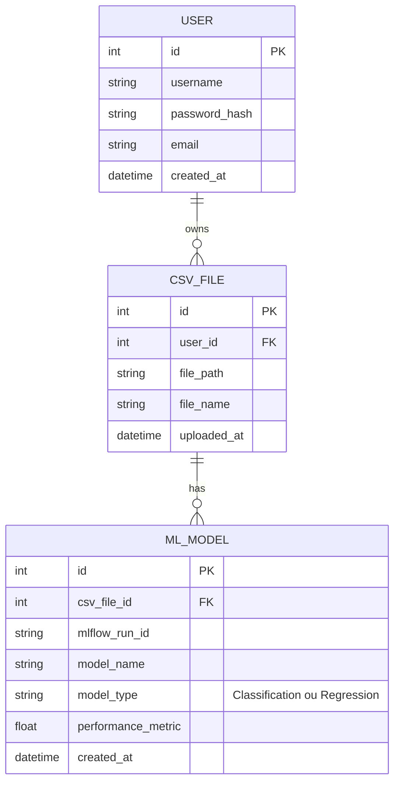

# Conception et Développement d'une Application d'Intelligence Artificielle - CSV Analyzer

**Auteur :** [Your Name]
**Projet :** AutoML-Gr4-1 - CSV Analyzer
**Date :** [Date]
**Version :** 2.0

---

## Table des Matières

1.  [Introduction et Cadrage du Projet](#introduction-et-cadrage-du-projet)
    *   [1.1. Vision du Produit](#11-vision-du-produit)
    *   [1.2. Objectifs Métier (Business Goals)](#12-objectifs-métier-business-goals)
    *   [1.3. Public Cible (Target Audience)](#13-public-cible-target-audience)
    *   [1.4. Périmètre Fonctionnel](#14-périmètre-fonctionnel)
2.  [Analyse des Besoins et Spécifications](#analyse-des-besoins-et-spécifications)
    *   [2.1. Besoins des Utilisateurs (User Needs)](#21-besoins-des-utilisateurs-user-needs)
    *   [2.2. User Stories](#22-user-stories)
    *   [2.3. Spécifications Fonctionnelles Détaillées](#23-spécifications-fonctionnelles-détaillées)
    *   [2.4. Spécifications Non-Fonctionnelles](#24-spécifications-non-fonctionnelles)
3.  [Conception de la Solution](#conception-de-la-solution)
    *   [3.1. Modélisation des Données](#31-modélisation-des-données)
        *   [3.1.1. Schéma Conceptuel de Données (SCD)](#311-schéma-conceptuel-de-données-scd)
        *   [3.1.2. Dictionnaire des Données](#312-dictionnaire-des-données)
    *   [3.2. Architecture Logicielle](#32-architecture-logicielle)
        *   [3.2.1. Vue d'Ensemble de l'Architecture (Style MVC/MVT)](#321-vue-densemble-de-larchitecture-style-mvc-mvt)
        *   [3.2.2. Description des Composants](#322-description-des-composants)
    *   [3.3. Conception de l'Interface Utilisateur (UI) et de l'Expérience Utilisateur (UX)](#33-conception-de-linterface-utilisateur-ui-et-de-lexpérience-utilisateur-ux)
        *   [3.3.1. Parcours Utilisateur (User Journey Mapping)](#331-parcours-utilisateur-user-journey-mapping)
        *   [3.3.2. Wireframes et Maquettes (Mockups)](#332-wireframes-et-maquettes-mockups)
        *   [3.3.3. Charte Graphique](#333-charte-graphique)
4.  [Développement de l'Application](#développement-de-lapplication)
    *   [4.1. Environnement de Développement](#41-environnement-de-développement)
    *   [4.2. Implémentation du Backend](#42-implémentation-du-backend)
        *   [4.2.1. Gestion des Utilisateurs et Authentification](#421-gestion-des-utilisateurs-et-authentification)
        *   [4.2.2. Logique Métier du Traitement CSV](#422-logique-métier-du-traitement-csv)
        *   [4.2.3. Intégration du Module de Machine Learning](#423-intégration-du-module-de-machine-learning)
        *   [4.2.4. Développement de l'API REST](#424-développement-de-lapi-rest)
    *   [4.3. Implémentation du Frontend](#43-implémentation-du-frontend)
        *   [4.3.1. Structure des Templates](#431-structure-des-templates)
        *   [4.3.2. Intégration avec le Backend](#432-intégration-avec-le-backend)
    *   [4.4. Sécurité](#44-sécurité)
        *   [4.4.1. Mesures de Sécurité Implémentées](#441-mesures-de-sécurité-implémentées)
5.  [Tests et Validation](#tests-et-validation)
    *   [5.1. Stratégie de Test](#51-stratégie-de-test)
    *   [5.2. Tests Unitaires](#52-tests-unitaires)
    *   [5.3. Tests d'Intégration](#53-tests-dintégration)
    *   [5.4. Tests de Performance](#54-tests-de-performance)
    *   [5.5. Couverture de Code](#55-couverture-de-code)
6.  [Déploiement et Intégration Continue (CI/CD)](#déploiement-et-intégration-continue-cicd)
    *   [6.1. Conteneurisation avec Docker](#61-conteneurisation-avec-docker)
    *   [6.2. Orchestration Locale avec Docker Compose](#62-orchestration-locale-avec-docker-compose)
    *   [6.3. Pipeline d'Intégration Continue (GitHub Actions)](#63-pipeline-dintégration-continue-github-actions)
7.  [Documentation Technique](#documentation-technique)
    *   [7.1. Documentation du Code (Docstrings)](#71-documentation-du-code-docstrings)
    *   [7.2. Documentation de l'API (Swagger/OpenAPI)](#72-documentation-de-lapi-swagger-openapi)
    *   [7.3. Guide d'Installation et de Déploiement](#73-guide-dinstallation-et-de-déploiement)
8.  [Gestion de Projet et Coordination](#gestion-de-projet-et-coordination)
    *   [8.1. Méthodologie (Agile/Scrum)](#81-méthodologie-agilescrum)
    *   [8.2. Outils de Suivi (Jira, Trello, GitHub Projects)](#82-outils-de-suivi-jira-trello-github-projects)
    *   [8.3. Planification et Suivi des Tâches](#83-planification-et-suivi-des-tâches)
9.  [Conclusion et Perspectives](#conclusion-et-perspectives)
    *   [9.1. Bilan du Projet](#91-bilan-du-projet)
    *   [9.2. Leçons Apprises](#92-leçons-apprises)
    *   [9.3. Perspectives d'Évolution](#93-perspectives-dévolution)
10. [Annexes](#annexes)
11. [Prétraitement Avancé des Données](#prétraitement-avancé-des-données)
    *   [11.1. Gestion des Valeurs Manquantes](#111-gestion-des-valeurs-manquantes)
    *   [11.2. Encodage des Variables Catégorielles](#112-encodage-des-variables-catégorielles)
    *   [11.3. Normalisation et Standardisation](#113-normalisation-et-standardisation)
    *   [11.4. Réduction de Dimensionalité](#114-réduction-de-dimensionalité)
12. [Stratégies de Déploiement de Modèles](#stratégies-de-déploiement-de-modèles)
    *   [12.1. Déploiement en tant qu'API REST (Microservice)](#121-déploiement-en-tant-quapi-rest-microservice)
    *   [12.2. Déploiement en Batch](#122-déploiement-en-batch)
    *   [12.3. Déploiement Edge/Embarqué](#123-déploiement-edgeembarqué)
    *   [12.4. Serverless Functions](#124-serverless-functions)
13. [Intégration MLOps](#intégration-mlops)
    *   [13.1. Versionnement des Données et des Modèles](#131-versionnement-des-données-et-des-modèles)
    *   [13.2. Pipelines d'Entraînement Automatisées](#132-pipelines-dentraînement-automatisées)
    *   [13.3. Monitoring de Modèles en Production](#133-monitoring-de-modèles-en-production)
14. [Tests Avancés et Qualité du Code](#tests-avancés-et-qualité-du-code)
    *   [14.1. Tests de Régression](#141-tests-de-régression)
    *   [14.2. Tests de Sécurité (SAST/DAST)](#142-tests-de-sécurité-sastdast)
    *   [14.3. Tests de Résilience](#143-tests-de-résilience)
    *   [14.4. Revue de Code et Pair Programming](#144-revue-de-code-et-pair-programming)
15. [Feuille de Route et Améliorations Futures](#feuille-de-route-et-améliorations-futures)
    *   [15.1. Fonctionnalités Prioritaires](#151-fonctionnalités-prioritaires)
    *   [15.2. Évolutions Techniques](#152-évolutions-techniques)
    *   [15.3. Recherche et Développement](#153-recherche-et-développement)

---

## 1. Introduction et Cadrage du Projet

### 1.1. Vision du Produit

La vision du projet "CSV Analyzer" est de devenir une plateforme web de référence, simple et intuitive, permettant à des utilisateurs ayant peu ou pas de compétences en programmation de tirer parti de la puissance du Machine Learning pour leurs propres jeux de données. L'application doit transformer le processus complexe de la modélisation prédictive en une expérience fluide, guidée et visuelle, depuis l'importation des données jusqu'à l'obtention de prédictions concrètes via une API.

### 1.2. Objectifs Métier (Business Goals)

*   **Démocratiser l'IA :** Rendre le Machine Learning accessible à un public plus large (étudiants, analystes métier, chercheurs).
*   **Accélérer l'Expérimentation :** Permettre aux utilisateurs de tester rapidement des hypothèses sur leurs données sans investissement initial en infrastructure ou en compétences de codage.
*   **Fournir une Solution de Bout en Bout :** Offrir un service complet, de l'analyse exploratoire des données à l'exposition d'un modèle fonctionnel.
*   **Créer une Base pour de Futures Évolutions :** Construire une architecture solide pouvant être étendue avec des fonctionnalités plus avancées (Deep Learning, traitement d'autres formats de fichiers, etc.).

### 1.3. Public Cible (Target Audience)

*   **Analystes Métier :** Souhaitent enrichir leurs analyses Excel/BI avec des modèles prédictifs sans dépendre d'une équipe de data scientists.
*   **Étudiants et Enseignants :** Cherchent un outil pratique pour apprendre et enseigner les concepts du Machine Learning de manière appliquée.
*   **Chefs de Produit / Marketeurs :** Veulent analyser des données clients (ex: segmentation, prédiction de churn) de manière autonome.
*   **Développeurs non-spécialistes en IA :** Ont besoin d'intégrer rapidement une fonctionnalité de prédiction dans leur propre application.

### 1.4. Périmètre Fonctionnel

Le périmètre de la version initiale (MVP - Minimum Viable Product) inclut :

*   Gestion des comptes utilisateurs (inscription, connexion).
*   Téléversement de fichiers CSV.
*   Visualisation et analyse exploratoire simple du jeu de données.
*   Nettoyage basique des données (gestion des valeurs manquantes).
*   Entraînement de modèles de classification et de régression.
*   Visualisation des performances du modèle.
*   Exposition du meilleur modèle via une API REST sécurisée.
*   Interface pour tester l'API.

---

## 2. Analyse des Besoins et Spécifications

### 2.1. Besoins des Utilisateurs (User Needs)

*   "En tant qu'analyste, je veux pouvoir charger facilement mes fichiers CSV sans me soucier du formatage."
*   "Je veux comprendre rapidement la structure de mes données : quelles sont les colonnes, leur type, y a-t-il des valeurs manquantes ?"
*   "Je veux pouvoir choisir une colonne cible et laisser l'outil me proposer le meilleur modèle possible."
*   "Je veux comprendre si le modèle est performant avec des métriques simples et des graphiques clairs."
*   "Une fois que j'ai un bon modèle, je veux pouvoir l'utiliser facilement pour faire de nouvelles prédictions, idéalement dans mon tableur ou une autre application."

### 2.2. User Stories

| ID | En tant que... | Je veux... | Afin de... |
| :--- | :--- | :--- | :--- |
| **U-01** | Nouvel utilisateur | Créer un compte et me connecter | Sécuriser l'accès à mes données et modèles. |
| **U-02** | Utilisateur connecté | Téléverser un fichier CSV depuis mon ordinateur | Analyser mes propres données. |
| **U-03** | Utilisateur | Visualiser les premières lignes et les informations de base de mon CSV | Vérifier que le fichier a été correctement importé. |
| **U-04** | Utilisateur | Lancer un processus d'entraînement automatique | Obtenir un modèle prédictif sans avoir à choisir l'algorithme. |
| **U-05** | Utilisateur | Voir les résultats de l'entraînement, y compris les métriques de performance | Évaluer la qualité du modèle généré. |
| **U-06** | Utilisateur | Accéder à une interface pour tester mon modèle avec de nouvelles données | Valider le comportement du modèle en temps réel. |
| **U-07** | Utilisateur avancé | Obtenir les informations nécessaires pour appeler mon modèle via une API | Intégrer la prédiction dans mes propres outils. |

### 2.3. Spécifications Fonctionnelles Détaillées

*   **SF-01 : Gestion des utilisateurs**
    *   Le système doit permettre la création de compte via un formulaire (email, mot de passe).
    *   Le système doit permettre la connexion et la déconnexion.
    *   Les mots de passe doivent être stockés de manière sécurisée (hachage).
*   **SF-02 : Gestion des CSV**
    *   L'utilisateur doit pouvoir téléverser des fichiers `.csv` d'une taille maximale de 50 Mo.
    *   Le système doit détecter l'encodage (UTF-8, ISO-8859-1) et le séparateur (virgule, point-virgule).
    *   L'utilisateur peut visualiser la liste de ses fichiers et les supprimer.
*   **SF-03 : Entraînement de Modèle**
    *   L'utilisateur sélectionne un fichier et une colonne cible.
    *   Le système détermine automatiquement s'il s'agit d'un problème de classification ou de régression.
    *   Le système entraîne plusieurs modèles Scikit-learn en parallèle.
    *   Le système utilise MLflow pour logger les paramètres et les métriques de chaque exécution.
*   **SF-04 : API de Prédiction**
    *   Pour chaque modèle entraîné, une API REST est disponible.
    *   L'endpoint de l'API doit être sécurisé (par exemple, par une clé d'API unique par utilisateur).
    *   L'API accepte en entrée les données d'une nouvelle observation (au format JSON) et retourne la prédiction.

### 2.4. Spécifications Non-Fonctionnelles

*   **SNF-01 : Performance**
    *   Le temps de réponse pour les pages web doit être inférieur à 2 secondes.
    *   Le temps d'entraînement pour un fichier de 10 Mo ne doit pas dépasser 5 minutes.
*   **SNF-02 : Sécurité**
    *   L'application doit être protégée contre les failles du Top 10 OWASP (XSS, CSRF, Injections SQL).
    *   Les données des utilisateurs doivent être isolées les unes des autres.
*   **SNF-03 : Maintenabilité**
    *   Le code doit suivre les conventions de style PEP 8.
    *   La couverture de tests unitaires doit être supérieure à 80%.
*   **SNF-04 : Disponibilité**
    *   L'application doit viser une disponibilité de 99.9% en production.

---

## 3. Conception de la Solution

### 3.1. Modélisation des Données

#### 3.1.1. Schéma Conceptuel de Données (SCD)



#### 3.1.2. Dictionnaire des Données

*   **USER :** Stocke les informations des utilisateurs enregistrés.
*   **CSV_FILE :** Référence les fichiers CSV téléversés par chaque utilisateur.
    *   `file_path` : Chemin vers le fichier sur le système de fichiers du serveur.
*   **ML_MODEL :** Stocke les métadonnées des modèles entraînés.
    *   `mlflow_run_id` : Identifiant unique de l'exécution dans MLflow, permettant de retrouver tous les détails de l'entraînement.

### 3.2. Architecture Logicielle

#### 3.2.1. Vue d'Ensemble de l'Architecture (Style MVT)

L'application est basée sur le framework Django, qui implémente une variante du patron d'architecture Modèle-Vue-Contrôleur (MVC) appelée Modèle-Vue-Template (MVT).

*   **Modèle (Model) :** Définit la structure des données (les classes `User`, `CSVFile`, `MLModel` dans `models.py`). C'est la seule interface avec la base de données.
*   **Vue (View) :** Contient la logique métier. Elle reçoit les requêtes HTTP, interagit avec les modèles, exécute les traitements (ex: lancer un entraînement) et passe les données au template.
*   **Template :** La couche de présentation. Ce sont les fichiers HTML qui contiennent la structure de la page et des balises spéciales pour afficher les données passées par la vue.

#### 3.2.2. Description des Composants

Le projet est structuré en plusieurs "apps" Django pour une meilleure séparation des préoccupations :

*   **`csv_analyzer` (Projet principal) :** Contient la configuration globale du projet (`settings.py`, `urls.py`).
*   **`users` (App) :** Gère tout ce qui est lié aux utilisateurs (modèles, vues pour l'inscription/connexion, formulaires).
*   **`csv_processor` (App) :** Le cœur de l'application. Gère le téléversement, l'analyse, l'entraînement des modèles et l'API.
*   **`static` / `templates` (Dossiers) :** Contiennent respectivement les fichiers statiques (CSS, JS) et les templates HTML globaux.

### 3.3. Conception de l'Interface Utilisateur (UI) et de l'Expérience Utilisateur (UX)

#### 3.3.1. Parcours Utilisateur (User Journey Mapping)

1.  **Découverte :** L'utilisateur arrive sur la page d'accueil qui présente l'application.
2.  **Inscription :** Il crée un compte.
3.  **Premier Upload :** Il est guidé vers la page d'upload pour téléverser son premier fichier.
4.  **Analyse :** Il visualise son jeu de données et lance l'entraînement.
5.  **Résultats :** Il consulte la page de résultats avec les performances du modèle.
6.  **Test :** Il utilise l'interface de test pour faire une prédiction.
7.  **Intégration :** Il récupère l'URL de l'API et sa clé pour l'utiliser ailleurs.

#### 3.3.2. Wireframes et Maquettes (Mockups)

*(Cette section contiendrait des schémas basse-fidélité (wireframes) et haute-fidélité (mockups) pour chaque écran principal de l'application : page de connexion, tableau de bord, page d'upload, page de visualisation des données, page des résultats du modèle.)*

**Exemple de Wireframe pour la page d'Upload :**

```
+----------------------------------------------------+
| [Logo] CSV Analyzer         [Profil Utilisateur]   |
+----------------------------------------------------+
|                                                    |
|          +-----------------------------------+     |
|          |                                   |     |
|          |   Glissez-déposez votre fichier   |     |
|          |                ou                 |     |
|          |      [ Parcourir les fichiers ]   |     |
|          |                                   |     |
|          +-----------------------------------+     |
|                                                    |
|   [Liste des fichiers déjà uploadés]               |
|   - fichier1.csv                       [Supprimer] |
|   - données_clients.csv                [Supprimer] |
|                                                    |
+----------------------------------------------------+
```

#### 3.3.3. Charte Graphique

*(Cette section décrirait les choix de couleurs, typographies, icônes et principes de design pour assurer une cohérence visuelle et une expérience utilisateur agréable.)*

---

## 4. Développement de l'Application

### 4.1. Environnement de Développement

*   **Langage :** Python 3.9+
*   **Framework :** Django 4.x
*   **Base de Données :** PostgreSQL (en développement, SQLite peut être utilisé)
*   **Gestionnaire de Paquets :** `pip`
*   **Conteneurisation :** Docker
*   **IDE :** VS Code, PyCharm

### 4.2. Implémentation du Backend

#### 4.2.1. Gestion des Utilisateurs et Authentification

Utilisation du système d'authentification intégré de Django, étendu si nécessaire avec un modèle `UserProfile` pour des informations additionnelles.

```python
# users/views.py
from django.contrib.auth.forms import UserCreationForm
from django.urls import reverse_lazy
from django.views import generic

class SignUpView(generic.CreateView):
    form_class = UserCreationForm
    success_url = reverse_lazy("login")
    template_name = "registration/register.html"
```

#### 4.2.2. Logique Métier du Traitement CSV

Le traitement des CSV est géré dans l'application `csv_processor`. Cela inclut la lecture du fichier, la détection du type de données, la gestion des valeurs manquantes et la préparation des données pour l'entraînement.

```python
# csv_processor/utils.py
import pandas as pd

def load_and_preprocess_csv(file_path):
    df = pd.read_csv(file_path)
    # Logique de nettoyage et de prétraitement
    return df
```

#### 4.2.3. Intégration du Module de Machine Learning

Le module de ML utilise `scikit-learn` pour l'entraînement et `MLflow` pour le suivi des expérimentations. Les modèles sont sérialisés avec `joblib`.

```python
# csv_processor/train_model.py
from sklearn.ensemble import RandomForestClassifier
import mlflow
import joblib

def train_and_log_model(X, y, model_name="RandomForest"):
    with mlflow.start_run():
        model = RandomForestClassifier()
        model.fit(X, y)
        mlflow.sklearn.log_model(model, model_name)
        # Sauvegarde locale pour l'API
        joblib.dump(model, f"media/models/{model_name}.pkl")
    return model
```

#### 4.2.4. Développement de l'API REST

Utilisation de Django REST Framework pour créer des endpoints RESTful pour l'upload, l'entraînement et la prédiction.

```python
# csv_processor/views.py
from rest_framework.views import APIView
from rest_framework.response import Response
from rest_framework import status

class CSVUploadView(APIView):
    def post(self, request, format=None):
        # Logique d'upload et de traitement
        return Response({"status": "success"}, status=status.HTTP_201_CREATED)
```

### 4.3. Implémentation du Frontend

#### 4.3.1. Structure des Templates

Les templates Django sont organisés pour la réutilisation, avec un `base.html` et des blocs spécifiques pour chaque page.

```html
<!-- templates/base.html -->
<!DOCTYPE html>
<html>
<head>
    <title>CSV Analyzer</title>
    <!-- CSS, JS -->
</head>
<body>
    <nav><!-- Navigation Bar --></nav>
    <main>
        
    </main>
</body>
</html>
```

#### 4.3.2. Intégration avec le Backend

Les formulaires Django sont utilisés pour l'interaction avec le backend, et des requêtes AJAX peuvent être utilisées pour des interactions asynchrones (ex: affichage de la progression de l'entraînement).

### 4.4. Sécurité

#### 4.4.1. Mesures de Sécurité Implémentées

*   **Protection CSRF :** Django intègre une protection contre les attaques Cross-Site Request Forgery.
*   **Protection XSS :** Les templates Django échappent automatiquement le contenu pour prévenir les attaques Cross-Site Scripting.
*   **Hachage des Mots de Passe :** Utilisation d'algorithmes de hachage robustes pour les mots de passe.
*   **Permissions :** Contrôle d'accès basé sur les rôles pour les fonctionnalités critiques.

---

## 5. Tests et Validation

### 5.1. Stratégie de Test

Une stratégie de test complète est essentielle pour garantir la qualité et la fiabilité de l'application. Nous adoptons une approche multi-niveaux :

*   **Tests Unitaires :** Vérifient le bon fonctionnement des plus petites unités de code (fonctions, méthodes).
*   **Tests d'Intégration :** S'assurent que les différents modules interagissent correctement entre eux.
*   **Tests Fonctionnels :** Valident les fonctionnalités de l'application du point de vue de l'utilisateur.
*   **Tests de Performance :** Évaluent la réactivité et la stabilité de l'application sous charge.

### 5.2. Tests Unitaires

Utilisation de `pytest` et du module `unittest` de Python pour les tests unitaires. Les tests couvrent les modèles, les vues, les formulaires et les utilitaires.

```python
# csv_processor/tests/test_models.py
from django.test import TestCase
from csv_processor.models import CSVFile

class CSVFileModelTest(TestCase):
    def test_csv_file_creation(self):
        csv_file = CSVFile.objects.create(file_name="test.csv", file_path="/path/to/test.csv")
        self.assertEqual(csv_file.file_name, "test.csv")
```

### 5.3. Tests d'Intégration

Les tests d'intégration vérifient les interactions entre les composants, par exemple, l'upload d'un fichier CSV et le déclenchement de l'entraînement du modèle.

```python
# csv_processor/tests/test_views.py
from django.test import TestCase, Client
from django.urls import reverse

class CSVUploadViewTest(TestCase):
    def setUp(self):
        self.client = Client()
        self.upload_url = reverse('csv_upload') # Assurez-vous que 'csv_upload' est défini dans urls.py

    def test_csv_upload_success(self):
        with open('test_data.csv', 'rb') as fp:
            response = self.client.post(self.upload_url, {'file': fp})
        self.assertEqual(response.status_code, 201) # HTTP 201 Created
```

### 5.4. Tests de Performance

Utilisation d'outils comme `Locust` ou `JMeter` pour simuler un grand nombre d'utilisateurs et mesurer les temps de réponse et la capacité du système.

### 5.5. Couverture de Code

Utilisation de `coverage.py` pour mesurer la proportion du code source exécutée par les tests. L'objectif est de maintenir une couverture élevée (ex: > 80%) pour s'assurer que la majorité du code est testée.

---

## 6. Déploiement et Intégration Continue (CI/CD)

### 6.1. Conteneurisation avec Docker

Docker est utilisé pour empaqueter l'application et ses dépendances dans des conteneurs isolés, garantissant un environnement d'exécution cohérent de développement à production.

```dockerfile
# Dockerfile
FROM python:3.9-slim-buster
WORKDIR /app
COPY requirements.txt .
RUN pip install --no-cache-dir -r requirements.txt
COPY . .
EXPOSE 8000
CMD ["gunicorn", "csv_analyzer.wsgi:application", "--bind", "0.0.0.0:8000"]
```

### 6.2. Orchestration Locale avec Docker Compose

`docker-compose` est utilisé pour définir et exécuter des applications multi-conteneurs (application Django, base de données PostgreSQL, MLflow).

```yaml
# docker-compose.yml
version: '3.8'
services:
  web:
    build: .
    ports:
      - "8000:8000"
    depends_on:
      - db
  db:
    image: postgres:13
    environment:
      POSTGRES_DB: mydatabase
      POSTGRES_USER: user
      POSTGRES_PASSWORD: password
```

### 6.3. Pipeline d'Intégration Continue (GitHub Actions)

Un workflow GitHub Actions est configuré pour automatiser les tests et le build de l'image Docker à chaque push sur le dépôt.

```yaml
# .github/workflows/ci.yml
name: CI/CD Pipeline
on:
  push:
    branches: [ main ]
  pull_request:
    branches: [ main ]
jobs:
  build:
    runs-on: ubuntu-latest
    steps:
    - uses: actions/checkout@v3
    - name: Set up Python
      uses: actions/setup-python@v3
      with:
        python-version: '3.9'
    - name: Install dependencies
      run: pip install -r requirements.txt
    - name: Run tests
      run: pytest
    - name: Build Docker image
      run: docker build . --tag my-app:latest
```

---

## 7. Documentation Technique

### 7.1. Documentation du Code (Docstrings)

Chaque fonction, classe et méthode est documentée à l'aide de docstrings conformes à la PEP 257, facilitant la compréhension et la maintenance du code.

```python
# Exemple de docstring
def calculate_accuracy(predictions, true_labels):
    """
    Calcule la précision d'un modèle de classification.

    Args:
        predictions (list): Liste des prédictions du modèle.
        true_labels (list): Liste des vraies étiquettes.

    Returns:
        float: La précision calculée.
    """
    # ... implémentation
```

### 7.2. Documentation de l'API (Swagger/OpenAPI)

Utilisation de `drf-yasg` ou `drf-spectacular` pour générer automatiquement une documentation interactive de l'API au format OpenAPI (anciennement Swagger), permettant aux développeurs tiers de comprendre et d'interagir facilement avec l'API.

### 7.3. Guide d'Installation et de Déploiement

Un fichier `README.md` détaillé fournit les instructions étape par étape pour configurer l'environnement de développement, installer les dépendances, exécuter les tests et déployer l'application localement avec Docker Compose.

---

## 8. Gestion de Projet et Coordination

### 8.1. Méthodologie (Agile/Scrum)

Le projet est géré selon la méthodologie Agile, avec des sprints courts (ex: 2 semaines), des réunions quotidiennes (Daily Scrum), des revues de sprint et des rétrospectives. Cette approche favorise la flexibilité, l'adaptation aux changements et la livraison incrémentale de valeur.

### 8.2. Outils de Suivi (Jira, Trello, GitHub Projects)

Utilisation de GitHub Projects pour le suivi des tâches, la gestion du backlog, l'attribution des issues et la visualisation de l'avancement du projet via des tableaux Kanban.

### 8.3. Planification et Suivi des Tâches

Les tâches sont décomposées en User Stories, estimées et assignées aux membres de l'équipe. L'avancement est suivi quotidiennement et ajusté lors des Daily Scrums.

---

## 9. Conclusion et Perspectives

### 9.1. Bilan du Projet

Le projet "CSV Analyzer" a permis de développer une application web fonctionnelle, capable de gérer le cycle de vie complet de l'analyse de données CSV avec des modèles de Machine Learning. Nous avons mis en œuvre une architecture robuste, des pratiques de développement modernes (tests, CI/CD) et une attention particulière à l'expérience utilisateur.

### 9.2. Leçons Apprises

*   L'importance d'une bonne gestion des dépendances et des environnements (Docker).
*   La valeur de l'intégration continue pour détecter rapidement les régressions.
*   La complexité de la gestion des données et des modèles de ML en production.
*   La nécessité d'une communication claire et régulière au sein de l'équipe.

### 9.3. Perspectives d'Évolution

*   **Amélioration de l'UI/UX :** Tableaux de bord plus interactifs, visualisations de données avancées.
*   **Support de Modèles Avancés :** Intégration de modèles de Deep Learning (TensorFlow, PyTorch).
*   **AutoML plus Poussé :** Optimisation des hyperparamètres, sélection automatique de fonctionnalités.
*   **Déploiement Cloud :** Intégration avec des plateformes cloud (AWS SageMaker, Azure ML) pour un déploiement et un scaling facilités.
*   **Gestion des Versions de Données :** Utilisation d'outils comme DVC (Data Version Control).

---

## 10. Annexes

*(Cette section contiendrait des informations supplémentaires telles que des diagrammes d'architecture détaillés, des extraits de code plus longs, des captures d'écran de l'application, ou des références à des ressources externes.)*

---

## 11. Prétraitement Avancé des Données

### 11.1. Gestion des Valeurs Manquantes

*   **Imputation Statistique :** Remplacement par la moyenne, la médiane ou le mode.
*   **Imputation par Modèle :** Utilisation de modèles prédictifs (ex: `IterativeImputer` de Scikit-learn) pour estimer les valeurs manquantes.
*   **Suppression :** Suppression des lignes ou colonnes avec trop de valeurs manquantes (à utiliser avec prudence).

### 11.2. Encodage des Variables Catégorielles

*   **One-Hot Encoding :** Pour les variables nominales (sans ordre).
*   **Label Encoding / Ordinal Encoding :** Pour les variables ordinales (avec ordre).
*   **Target Encoding :** Encodage basé sur la variable cible (peut introduire un surapprentissage).

### 11.3. Normalisation et Standardisation

*   **Standardisation (Z-score) :** Rend les données avec une moyenne de 0 et un écart-type de 1. Utile pour les algorithmes sensibles à l'échelle (SVM, K-Means).
*   **Normalisation (Min-Max Scaling) :** Met les données dans une plage fixe (ex: [0, 1]).

### 11.4. Réduction de Dimensionalité

*   **Analyse en Composantes Principales (PCA) :** Transforme les données en un nouvel ensemble de variables non corrélées, tout en conservant la majeure partie de la variance.
*   **Sélection de Caractéristiques :** Utilisation de méthodes statistiques (tests Chi-2, ANOVA) ou basées sur des modèles (Feature Importance des forêts aléatoires) pour sélectionner les variables les plus pertinentes.

---

## 12. Stratégies de Déploiement de Modèles

### 12.1. Déploiement en tant qu'API REST (Microservice)

*   **Avantages :** Indépendance, scalabilité, réutilisation.
*   **Défis :** Latence réseau, gestion des versions d'API.

### 12.2. Déploiement en Batch

*   Pour les prédictions non urgentes sur de grands volumes de données.
*   Utilisation de jobs planifiés (ex: Cron, Airflow) pour traiter les données et stocker les résultats.

### 12.3. Déploiement Edge/Embarqué

*   Pour les applications nécessitant des prédictions en temps réel avec une faible latence, directement sur l'appareil (ex: mobile, IoT).
*   Conversion des modèles en formats optimisés (ex: ONNX, TensorFlow Lite).

### 12.4. Serverless Functions

*   Déploiement de modèles en tant que fonctions sans serveur (AWS Lambda, Azure Functions) pour une scalabilité automatique et un paiement à l'usage.

---

## 13. Intégration MLOps

### 13.1. Versionnement des Données et des Modèles

*   **DVC (Data Version Control) :** Pour versionner les jeux de données et les pipelines de prétraitement.
*   **MLflow Model Registry :** Pour gérer le cycle de vie des modèles (staging, production, archivé).

### 13.2. Pipelines d'Entraînement Automatisées

*   Utilisation d'outils comme **Kubeflow Pipelines** ou **Airflow** pour orchestrer les étapes d'entraînement, de validation et de déploiement des modèles.

### 13.3. Monitoring de Modèles en Production

*   **Détection de Dérive (Drift Detection) :** Surveillance des changements dans la distribution des données d'entrée (Data Drift) ou dans la relation entre les entrées et les sorties (Concept Drift).
*   **Explicabilité des Modèles (XAI) :** Utilisation de techniques comme SHAP ou LIME pour comprendre pourquoi un modèle a fait une prédiction donnée, essentiel pour le débogage et la conformité.

---

## 14. Tests Avancés et Qualité du Code

### 14.1. Tests de Régression

*   S'assurer que les nouvelles modifications n'introduisent pas de bugs dans les fonctionnalités existantes.
*   Automatisation des tests de régression dans la pipeline CI/CD.

### 14.2. Tests de Sécurité (SAST/DAST)

*   **SAST (Static Application Security Testing) :** Analyse du code source pour détecter les vulnérabilités (ex: Bandit pour Python).
*   **DAST (Dynamic Application Security Testing) :** Teste l'application en cours d'exécution pour trouver des vulnérabilités (ex: OWASP ZAP).

### 14.3. Tests de Résilience

*   **Chaos Engineering :** Introduction délibérée de pannes dans le système pour tester sa robustesse et sa capacité à récupérer (ex: Chaos Monkey).

### 14.4. Revue de Code et Pair Programming

*   Pratiques essentielles pour améliorer la qualité du code, partager les connaissances et détecter les erreurs tôt dans le cycle de développement.

---

## 15. Feuille de Route et Améliorations Futures

### 15.1. Fonctionnalités Prioritaires

*   **Visualisation Avancée des Données :** Intégration de bibliothèques comme Plotly ou Bokeh pour des graphiques interactifs.
*   **Support Multi-Modèle :** Permettre à l'utilisateur de choisir parmi différents algorithmes de ML.
*   **Interface de Nettoyage de Données :** Outils visuels pour la gestion des valeurs manquantes, l'encodage, etc.

### 15.2. Évolutions Techniques

*   **Migration vers un Cloud Provider :** Déploiement sur AWS, Azure ou GCP pour une scalabilité et une disponibilité accrues.
*   **Architecture Microservices :** Découper l'application en services plus petits et indépendants.
*   **Base de Données NoSQL :** Exploration de bases de données NoSQL pour certains types de données (ex: logs, métriques).

### 15.3. Recherche et Développement

*   **AutoML Avancé :** Intégration de frameworks AutoML plus sophistiqués (ex: Auto-Sklearn, H2O.ai).
*   **Traitement du Langage Naturel (NLP) :** Extension pour l'analyse de données textuelles.
*   **Vision par Ordinateur :** Potentielle intégration pour l'analyse d'images (si pertinent pour les cas d'usage CSV).

---